<!-- @format -->

# Summary

- [Summary](#summary)
    - [introduction](#introduction)
        - [가상화(virtualization)](#가상화virtualization)
            - [virtualizing the CPU](#virtualizing-the-cpu)
            - [virtualizing the Memory](#virtualizing-the-memory)
        - [동시성(concurrency)](#동시성concurrency)
        - [저장(persistence)](#저장persistence)
        - [Desgin Goal](#desgin-goal)
    - [The Abstraction: The Process](#the-abstraction-the-process)
        - [Process API](#process-api)
        - [Process Creation: A Littel More Detail](#process-creation-a-littel-more-detail)
        - [Process States](#process-states)
        - [Data Structures](#data-structures)
    - [Interlude: Process API](#interlude-process-api)
        - [`fork()`](#fork)
        - [`wait()`](#wait)
        - [`exec()`](#exec)
        - [API 동기부여](#api-동기부여)
        - [프로세스 제어와 유저](#프로세스-제어와-유저)
        - [기타 유용한 툴들](#기타-유용한-툴들)
    - [Direct Execution](#direct-execution)
        - [Basic Technique: **Limited** Direct Execution](#basic-technique-limited-direct-execution)
        - [Problem #1: Restricted Operations](#problem-1-restricted-operations)
        - [Problem #2: Switching Between Processes](#problem-2-switching-between-processes)
    - [Scheduling](#scheduling)
        - [Workload Assumptions](#workload-assumptions)
        - [Scheduling Metrics](#scheduling-metrics)
        - [First In, First Out (FIFO)](#first-in-first-out-fifo)
        - [Shortest Job First (SJF)](#shortest-job-first-sjf)
        - [Shortest Time-to-Completion First (STCF)](#shortest-time-to-completion-first-stcf)
        - [A New Metric: Response Time](#a-new-metric-response-time)
        - [Round Robin](#round-robin)
        - [Incorporating I/O](#incorporating-io)
        - [No More Oracle](#no-more-oracle)
    - [Scheduling: The Multi-Level Feedback Queue](#scheduling-the-multi-level-feedback-queue)
        - [MLFQ: Basic Rules](#mlfq-basic-rules)
        - [Attempt #1: How To Change Priority](#attempt-1-how-to-change-priority)
            - [Example 1: A Single Long-Running Job](#example-1-a-single-long-running-job)
            - [Example 2: Along Came A Short Job](#example-2-along-came-a-short-job)
            - [Example 3: What About I/O?](#example-3-what-about-io)
            - [Problems With Our Current MLFQ](#problems-with-our-current-mlfq)
        - [Attempt #2: The Priority Boost](#attempt-2-the-priority-boost)
        - [Attempt #3: Better Accounting](#attempt-3-better-accounting)
        - [Tuning MLFQ And Other Issues](#tuning-mlfq-and-other-issues)
        - [요약](#요약)
    - [Scheduling: Proportional Share(Lottery Scheduling)](#scheduling-proportional-sharelottery-scheduling)
        - [9.1 Basic Concept: Tickets Represent Your Share](#91-basic-concept-tickets-represent-your-share)
        - [9.2 Ticket Mechanisms](#92-ticket-mechanisms)
        - [9.3 Implementation](#93-implementation)
        - [9.4 An Example](#94-an-example)
        - [9.5 How To Assign Tickets?](#95-how-to-assign-tickets)
        - [9.6 Stride Scheduling](#96-stride-scheduling)
        - [9.7 The Linux `Completely Fair Scheduler` (`CFS`)](#97-the-linux-completely-fair-scheduler-cfs)
            - [Basic Operation](#basic-operation)
            - [Weighting (Niceness)](#weighting-niceness)
                - [time slice 계산](#time-slice-계산)
                - [`vruntime` 계산](#vruntime-계산)
            - [Using Red-Black Trees](#using-red-black-trees)
            - [Dealing With I/O And Sleeping Processes](#dealing-with-io-and-sleeping-processes)
    - [Multiprocessor Scheduling (Advanced)](#multiprocessor-scheduling-advanced)
        - [10.1 Background: Multiprocessor Architecture](#101-background-multiprocessor-architecture)
        - [10.2 Don’t Forget Synchronization](#102-dont-forget-synchronization)
    - [The Abstraction: Address Spaces](#the-abstraction-address-spaces)
        - [13.1 Early Systems](#131-early-systems)
        - [13.2 Multiprogramming and Time Sharing](#132-multiprogramming-and-time-sharing)
        - [13.3 The Address Space](#133-the-address-space)
        - [13.4 Goals](#134-goals)
    - [Interlude: Memory API](#interlude-memory-api)
        - [14.1 Types of Memory](#141-types-of-memory)
            - [stack](#stack)
            - [heap](#heap)
        - [14.2 The `malloc()` Call](#142-the-malloc-call)
        - [The `free()` Call](#the-free-call)
        - [14.4 Common Errors](#144-common-errors)
            - [Forgetting To Allocate Memory](#forgetting-to-allocate-memory)
            - [Not Allocating Enough Memory](#not-allocating-enough-memory)
            - [Forgetting to Initialize Allocated Memory](#forgetting-to-initialize-allocated-memory)
            - [Forgetting To Free Memory](#forgetting-to-free-memory)
            - [Freeing Memory Before You Are Done With It](#freeing-memory-before-you-are-done-with-it)
            - [Freeing Memory Repeatedly](#freeing-memory-repeatedly)
            - [Calling `free()` Incorrectly](#calling-free-incorrectly)
            - [요약](#요약-1)
        - [14.5 Underlying OS Support](#145-underlying-os-support)
        - [14.6 Other Calls](#146-other-calls)
    - [Mechanism: Address Translation](#mechanism-address-translation)
        - [15.1 Assumptions](#151-assumptions)
        - [15.2 An Example](#152-an-example)
        - [15.3 Dynamic (Hardware-based) Relocation](#153-dynamic-hardware-based-relocation)
            - [Example Translations](#example-translations)
        - [15.4 Hardware Support: A Summary](#154-hardware-support-a-summary)
            - [하드웨어 요구 사항](#하드웨어-요구-사항)
        - [15.5 Operating System Issues](#155-operating-system-issues)
            - [OS 책임 사항](#os-책임-사항)
            - [주소 공간 relocation by OS](#주소-공간-relocation-by-os)
            - [Limited Direct Execution (Dynamic Relocation) @ Boot and @ Runtime](#limited-direct-execution-dynamic-relocation--boot-and--runtime)
            - [고정 크기의 메모리 할당의 단점](#고정-크기의-메모리-할당의-단점)
    - [Segmentation](#segmentation)
        - [16.1 Segmentation: Generalized `Base`/`Bounds`](#161-segmentation-generalized-basebounds)
            - [example translation](#example-translation)
        - [16.2 Which Segment Are We Referring To?](#162-which-segment-are-we-referring-to)
            - [explicit approach](#explicit-approach)
            - [implicit approach](#implicit-approach)
        - [16.3 What About The Stack?](#163-what-about-the-stack)
    - [Concurrency and threads](#concurrency-and-threads)
        - [26.1 Why Use Threads?](#261-why-use-threads)
            - [`parallelism`](#parallelism)
            - [느린 I/O로 인한 프로그램 blokcing 회피](#느린-io로-인한-프로그램-blokcing-회피)
        - [26.2 An Example: Thread Creation](#262-an-example-thread-creation)
        - [26.3 Why It Gets Worse: Shared Data](#263-why-it-gets-worse-shared-data)
        - [26.4 The Heart Of The Problem: Uncontrolled Scheduling](#264-the-heart-of-the-problem-uncontrolled-scheduling)
        - [26.5 The Wish For Atomicity](#265-the-wish-for-atomicity)
        - [26.6 One More Problem: Waiting For Another](#266-one-more-problem-waiting-for-another)
        - [26.7 Summary: Why in OS Class?](#267-summary-why-in-os-class)

[OSTEP book chapters](https://pages.cs.wisc.edu/~remzi/OSTEP/#book-chapters)

## introduction

### 가상화(virtualization)

OS transform physical into virtual, how does the operating system virtualize resources?

OS를 아래와 같이 부르기도 한다.
1. as virtual machine
2. as resource(CPU, memory, disk) manager

OS API for system calls -> standard library for applications

due to virtualization:
1. run many programs => sharing CPU
2. the programs can **concurrently** access their own instructions and data => sharing memory
3. the progrmas cna access devices => sharing disks and so forth

#### virtualizing the CPU

a single CPU as the seemingly infinite number of CPU. It provides illusion of private CPU registers (mechanisms and policy)

- Processes and Threads
- [Scheduling](#scheduling)

#### virtualizing the Memory

물리적인 Memory는 bytes 배열.
1. read: 데이터가 저장된 `address`를 명시
2. write(update): 해당 주소에 쓰일 데이터를 명시

프로그램은 데이터를 메모리에 저장하고, load, stores 등의 명령어 통해 메모리에 접근하며, 각 프로그램의 명령(instruction)로 메모리에 있다. 따라서 메모리는 각 명령(instruction)을 가져올 때도 접근하게 된다

여러 프로그램이 각자 메모리 공간을 할당받는다. 해당 공간에 데이터 쓰기를 해도, 이는 각자의 가상 메모리 공간 내에서 이뤄지며, 다른 프로그램의 메모리를 업데이트하지는 않는다. 이는 물리적인 메모리를 다른 프로그램과 공유하기보다는, 각 프로그램이 각자의 private memory(**virtual address space**)를 갖기 때문이다.

### 동시성(concurrency)

> *Concurrent programming*, where different parts of a program execute independently, and *parallel programming*, where different parts of a program execute at the same time.
>
> 출처: [Fearless Concurrency](https://doc.rust-lang.org/book/ch16-00-concurrency.html)

OS는 여러 프로세스를 저글링 하듯 실행시키며, 각 프로세스는 또 여러 쓰레드를 가질 수 있다.

`thread`는,
1. 다른 함수와 같은 메모리 공간에서 실행되는 함수로 생각할 수 있으며,
2. 여러 개의 스레드가 동시에 활성화될 수 있다.

같은 메모리 공간에서 여러 함수가 같이 실행되므로, 만약 공유되는 메모리가 있고 이를 동시에 접근하게 된다면, 의도하지 않은 결과가 나올 수 있다.

```rs
fn worker() {
    for _i in 1..=WORKER_LOOPS {
        // 1. load the value of the counter(shared) from memory into a register
        COUNTER += 1; // 2.one to increment it and, 3. store it back into memory
    }
}
```

위 함수에서 `COUNTER`를 증가시키는 것은 세 가지 명령어(instruction)으로 구성된다
1. 공유되고 있는 `COUNTER`를 메모리에서 레지스터로 불러온다
2. 1을 증가시킨다
3. 증가된 `COUNTER`를 메모리에 저장한다

그런데 이 함수를 여러 쓰레드에서 동시에 실행시킬 떄, 저 세 명령어는 한번에 원자적(**atomically**)으로 실행되지 않는다. 따라서:
1. A 쓰레드에서 1을 증가시킬 때 B 쓰레드에서는 1을 증가시킨 값을 저장하고
2. 그 다음에 A 쓰레드가 증가시킨 값을 저장하면,
3. B가 증가시킨 값은 사라지게 된다

### 저장(persistence)

CPU나 메모리처럼 애플리케이션마다 가상화된 디스크를 만들지 않는다.
그보다는 오히려 파일의 정보를 **공유**하길 원한다고 가정한다

1. 새로운 파일이 어디에 위치할 것인지 파악하고, 이를 파일 시스템이 유지하는 다양한 구조 속에서 계속 트래킹해야 하며, 이는 더 로우 레벨에 있는 저장 장치에 I/O 요청하는 것이 필요하다
    1. 기존의 구조 읽기
    2. 수정하기
2. device driver를 작성해본 사람이라면 장치로 하여금 뭔가 하게 하는 것은 복잡한 일이며, low level에서의 장치 인터페이스와 정확한 의미에 대한 깊은 지식이 필요하다.
3. OS는 system call을 통해 장치에 접근할 수 있는 표준적이고 간단한 방법을 `standar library`로 제공한다

성능상의 이유로 대부분의 파일시스템은 먼저 이러한 쓰기를 더 큰 그룹으로 일괄 처리하기 위해 잠시 동안 시연시킨다

쓰기 동안의 시스템 충돌을 핸들링하기 위해, 대부분의 파일 시스템은 일종의 복잡한 쓰기 프로토콜인 `journaling` 또는 `copy-on-write`을 포함한다.
만약 쓰기 sequence 동안 실패한다면 나중에 시스템이 합리적인 상태로 복구될 수 있도록 디스크에 대한 쓰기 순서를 신중하게 지정한다.

서로 다른 공통 작업을 효율적으로 만들기 위해, file system은 간단한 목록에서부터 복잡한 b-tree까지 많은 다양한 자료 구조, 액세스 방법을 사용한다.

### Desgin Goal

- `virtualization` of resources
    - cpu
    - memory
    - disk
- treat `concurrency`
- `persistent` data
- `abstractions`
    - 큰 프로그램을 작성할 수 있도록 이를 이해할 수 있는 작은 조각들로 분할하는 것
    - `C > assembly > logic gate > processor > transistors`에서 C 언어로 개발할 때, 그 아래에 있는 것들을 신경쓰지 않도록 하는 것
- `protection` & `isolation`
    - 동시에 실행되는 애플리케이션이 서로 잘못된 영향을 주지 않도록 해야 한다
    - 그리고 OS 자체를 오염시키지 않아야 한다
- `reliability`
- `energy-efficiency`
- `security`
- `mobility`

OS가 개발되면서 축적된 아이디어들에 대해 알아보는 것도 설계에서 무엇이 중요한지 아는 데 도움이 된다.
- [BRINCH-HANSEN ON THE HISTORY OF OPERATING SYSTEMS](http://tristram.squarespace.com/home/2007/2/20/brinch-hansen-on-the-history-of-operating-systems.html)
- `procedure call`과 `system call`
    - `system call`은 하드웨어 권한 수준(hardware privilge level)을 높인다
    - [Difference Between System Call, Procedure Call, and Function Call](https://www.8bitavenue.com/difference-between-system-call-procedure-call-and-function-call/)
    - [Remote Procedure Calss vs Local Procedure Calls](https://www.baeldung.com/cs/remote-vs-local-procedure-calls)
    - [What is the difference between system calls and procedure calls?](https://qr.ae/pGdCgo)
    - [What Is the Difference Between Trap and Interrupt?](https://www.baeldung.com/cs/os-trap-vs-interrupt)
- `multiprogramming`
    - CPU 활용도 향상 목적
    - 여러 job들을 메모리에 로드하고 빠르게 switch
    - 느린 I/O 장치가 서비스 되는 동안 프로그램이 CPU에서 대기하면 CPU 시간 낭비

## The Abstraction: The Process

`process` == `running program`
- 프로그램 그자체는 실행되길 기다리는 명령어 뭉치일 뿐이다
- OS가 이 byte를 실행
- `process`는 프로그램을 실행하는 OS가 제공하는 추상화

CPU의 `time sharing`이라는 기본적인 테크닉 통해서 여러 프로그램을 동시에 실행할 수 있도록 한다.
- 낮은 수준의 기계(`machinery`)를 `mechanisms`(작동 방식)이라 부른다
    - 저수준의 메서드 또는 프로토콜
    - `time sharing` & `context switch`
- 높은 수준의 지능이 `policies`라는 형태로 OS에 존재
    - 정책은 OS에서 어떤 결정을 내리기 위한 알고리즘
    - `scheduling policy`

`machine state`: 프로그램 실행 중 읽거나 업데이트할 수 있는 것
- `memory`
    - `address space`
- `registers`
    - `program counter`(PC) == `instruction pointer`(IP)
        - 어떤 프로그램 명령어가 다음에 실행될지 말해준다
    - `stack pointer` & `frame pointer`
        - 함수 파라미터, 로컬 변수, 반환 주소(return addresses)을 관리

### Process API

프로세스와 관련하여 프로그램이 할 수 있는 요청들
- `Create`
- `Destroy`
- `Wait`
- `Miscellaneous Control`
- `Status`

### Process Creation: A Littel More Detail

> `load` code and static data from `disk` into `memory`
- load 방식
    - `eagerly`: 프로그램 실행 전에 한번에 로드
    - `lazily`: 프로그램 실쟁 동안 필요할 때 코드 조각과 데이터 로드
        - by `paging` & `swapping` of memory
- memory for `run-time stack`(a.k.a `stack`)
    - 인자(arguments)와 함께 스택을 초기화
    - 인자는 `argc`, `argv` 같은 배열로 `main()` 함수의 파라미터로 전달된다
- memory for `heap`
    - 명시적으로 요청되는, 동적으로 할당되는 데이터 위해 사용
    - 프로그램은 `malloc()` 같은 함수 호출해서 공간 요청
- default three `file descriptors`
    - STDIN
    - STDOUT
    - STRERR

### Process States

- `Running`: 프로세서에서 프로세스 실행중. 즉, 명령어 실행중
- `Ready`: 실행 준비 단계지만, 어떤 이유로 OS가 선택하지 않음
- `Blocked`: 다른 이벤트가 발생할 때까지 `Ready` 되지 않도록 만드는 작업을 프로세스가 수행한 경우. 가령 디스크에 I/O 요청을 발생시켰을 때, 블락되고 다른 프로세스가 processor를 사용

상태의 변화는 OS의 재량에 따르며, 이런 결정은 OS `scheduler`가 결정한다
- `Ready` to `Running`: scheduled
- `Running` to `Ready`: unscheduled
- `Running` -> initiate I/O request -> `Blocked` -> I/O completion -> `Ready`

### Data Structures

```c
// the registers xv6 will save and restore 
// to stop and subsequently restart a process
struct context {
  int eip;
  int esp;
  int ebx;
  int ecx;
  int edx;
  int esi;
  int edi;
  int ebp;
};

// the different states a process can be in
enum proc_state { 
  UNUSED, 
  EMBRYO, 
  SLEEPING,
  RUNNABLE, 
  RUNNING, 
  ZOMBIE // 종료됐지만 아직 정리되지 않은 프로세스 
};

// the information xv6 tracks about each process
// including its register context and state
struct proc {
  char *mem; // Start of process memory
  uint sz; // Size of process memory
  char *kstack; // Bottom of kernel stack
  // for this process
  enum proc_state state; // Process state
  int pid; // Process ID
  struct proc *parent; // Parent process
  void *chan; // If !zero, sleeping on chan
  int killed; // If !zero, has been killed
  struct file *ofile[NOFILE]; // Open files
  struct inode *cwd; // Current directory
  struct context context; // Switch here to run process
  struct trapframe *tf; // Trap frame for the
  // current interrupt
};
```

## Interlude: Process API

Unix 시스템은 프로세스 생성 위해 `fork()`와 `exec()`이라는 시스템 콜 한 쌍을 제공
`wait()`는 자신이 생성한 프로세스가 완료되기를 기다리려는 프로세스에서 사용할 수 있다

### `fork()`

- OS provides `fork()` as a way to create a new process
- the newly created process, child, is *almost exact copy of the calling process*, but isn’t an exact copy because it now has its own copy of the address space
- the child doesn’t start running at `main()`

### `wait()`

부모 프로세스와 자식 프로세스 중 무엇이 먼저 실행될지는 모르지만, `wait()` 시스템 콜을 사용해서
부모 프로세스가 먼저 실행될 경우 자식 프로세스를 기다리게 한다

```rs
// 부모 프로세스인 경우
Ok(NixParent { child, .. }) => {
    let result = waitpid(child, None);
    ... 생략 ...
}
```

### `exec()`

프로그램에서 다른 프로그램을 실행할 때 사용.

```rs
let words = execvp(
    &str_to_c_string("wc"),
    &[
        str_to_c_string("-cl"), // 안 먹히는듯?
        str_to_c_string(
            (env::current_dir().unwrap().as_path().display().to_string()
                + "/Cargo.toml")
                .as_str(),
        ),
    ],
);
```

아래와 같은 일이 이뤄진다
1. `fork()`로 생성된 자식 프로세스 생성
    - 이 포크 된 자식 프로세스는 부모 프로세스의 메모리 공간의 복사본을 갖는다
    - 이때 부모 프로세스의 복사본으로 초기화(initialized)
2. 실행 프로그램 `wc`와 인자들(가령 `-cl`, `Cargo.toml` 파일 경로 등)을 받는다
3. 실행 프로그램 `wc`의 코드와 정적 데이터를 로드하여 현재 코드의 세그먼트와 정적 데이터에 덮어쓴다
    - 이때 heap, stack, 기타 메모리 공간이 *다시* 초기화(re-initialize)된다

따라서 새로운 프로세스를 생성하는 것이 아니라, 그보다는 *현재 실행중*인 프로그램(예제에서 p3)을 다른 실행중인 프로그램(`wc`)로 변환한다.
자식 프로세스에서 `exec()`이 실행된 후에는 마치 부모 프로세스가 실행되지 않은 것과 같다. `exec()` 함수 호출이 성공하면 리턴하지 않기 때문이다.

### API 동기부여

이런 `fork()`와 `exec()`의 분리는 Unix shell을 빌드하는 데 필수적이다. 이런 `fork()`와 `exec()`의 분리는 shell이 **`fork()` 호출 다음**, **`exec()` 호출 전**에 코드를 실행하도록 하기 때문에, 이 코드는 실행 예정인(about-to-be-run) 프로그램의 환경을 바꿀 수 있고, 따라서 다양한 흥미로운 기능들을 쉽게 구현할 수 있다.

shell은 유저 프로그램이다. prompt가 나타나고, 뭔가 타이핑하길 기다린다.
커맨드를 타이핑하면, 대부분의 경우, 쉘은 다음과 같이 작동한다
1. 실행할 수 있는 프로그램이 파일 시스템 어디에 위치하는지 파악하고
2. 커맨드를 실행하기 위해 `fork()`를 호출하여 새로운 자식 프로세스를 만들고
3. 커맨드를 실행하기 위해 여러 `exec()` 변형 중 하나를 호출
4. `wait()` 호출하여 커맨드가 완료될 때까지 대기
5. 자식 프로세스가 끝나면 쉘은 `wait()`에서 돌아오며, prompt를 다시 출력하고 다음 커맨드를 기다린다

```shell
wc /Users/rody/VscodeProjects/ostep/Cargo.toml > /Users/rody/VscodeProjects/ostep/tmp/wc_output.txt
```

`>` 통해서 `wc`의 출력은 `wc_output.txt` 파일로 리다이렉트 된다.
1. `wc` 프로그램이 파일 시스템 어디에 위치하는지 파악
2. 커맨드를 실행하기 위해 `fork()`를 호출하여 새로운 자식 프로세스를 만들고
3. standard output을 닫고 `wc_output.txt`을 연다(이로 인해 곧 실행될(soon-to-be-running) 프로그램 `wc`의 출력은 스크린 대신 파일로 보내진다)
4. 커맨드를 실행하기 위해 여러 `exec()` 변형 중 하나를 호출
5. `wait()` 호출하여 커맨드가 완료될 때까지 대기
6. 자식 프로세스가 끝나면 쉘은 `wait()`에서 돌아오며, prompt를 다시 출력하고 다음 커맨드를 기다린다

유닉스 파이프는 같은 방식으로 구현되지만, `pipe()` 시스템 콜을 호출한다.
1. 한 프로세스의 출력이 커널 내부(in-kernal)의 파이프(즉, 큐)로 연결되고,
2. 다른 프로세스의 입력 부분이 같은 파이프로 연결된다.
3. 따라서 한 프로세스의 출력이 매끄럽게 다음 프로그램의 입력으로 사용된다.

### 프로세스 제어와 유저

- `kill()`: 프로세스에 signal 보낼 때 사용
    - pause, die 등의 명령어
    - 편의를 위해 유닉스 쉘에는 특정 키 스트로크 조합이 특정 신호를 보내도록 설정되어 있음
        - control + c: *SIGINT*(interrupt) 보통 프로세스 종료
        - control + z: *SIGTSTP*(stop) 실행중 일시 정지. `fg` 같은 내장 명령어로 다시 실행 가능
    - 외부의 이벤트를 프로세스로 전달하는 신호(signal)들 제공하며, 개별 프로세스와 전체 프로세스 그룹에 신호를 보낼 수 있다
- `signal()`: 프로세스가 시스템 콜을 캐치하기 위해 사용

그렇다면 누가 시그널을 보낼 수 있고 누구는 보낼 수 없는가? 보통 여러 사용자가 시스템을 사용하며, 누군가 임으로 신호를 보낼 수 있다면 시스템의 사용성과 보안성이 저하된다. 따라서 요즘 시스템은  `user`라는 강력한 개념을 포함한다.

### 기타 유용한 툴들

- `man`
- `ps`
- `top`
- `spawn`
- `killall`
- CPU meters like [MenuMeters](http://www.ragingmenace.com/software/menumeters/)

## Direct Execution

CPU 가상화는 각 프로세스를 잠깐씩 실행하는 `time sharing`을 통해서 이뤄진다. 그런데 이런 가상화 작동 방식을 구현하는 데는 몇 가지 문제가 있다.
1. *performance*: 추가적인 부하 없이 가능한가?
2. *control*: CPU에 대한 제어를 유지하면서 어떦게 프로세스를 효율적으로 실행?

### Basic Technique: **Limited** Direct Execution

`direct execution`? just run the program directly on the CPU
1. 프로세스 리스트에 프로세스 entry 생성
2. 프로그램 위한 메모리 할당
3. 디스크에서 프로그램 코드를 메모리로 로드
4. `argc`, `argv`로 스택 셋업
5. registers 비우기
6. `main()` 같은 루틴의 진입점(entry point)을 찾아서 해당 지점으로 이동
7. 유저의 코드를 실행시키기 시작
8. 프로세스의 메모리 해제(free)
9. 프로세스 리스트에서 삭제

이런 접근 방식은 CPU 가상화에 몇 가지 문제점 야기
1. 어떻게 OS로 하여금 프로그램이 우리가 원하지 않는 것을 안하게 하도록 보장?
    - `user mode`, `kernal mode`로 권한 분리
2. 어떻게 OS가 실행중인 프로그램을 멈추고 다른 프로세스로 전환?

### Problem #1: Restricted Operations

- `user mode`: 프로세스가 원하는대로 모든 자원을 사용하지 못하도록 제한하는 processor mode
- `kernal mode`: OS가 실행되는 모드로, 모든 제한된 명령을 실행할 수 있다

만약 유저 모드의 프로그램이 권한이 필요한 작업을 수행하길 원한다면? 요즘의 모든 하드웨어는 가상적으로(virtually) system call을 요청할 수 있도록 하고 있다

user mode process  
-> `trap` instruction  
-> jump into kernal  
-> kernal mode  
-> `return-from-trap` call by OS  

On x86
1. The processor will push the program counter, flags, and a few other registers onto a per-process `kernel stack`
2. the `return-from-trap` will pop these values off the stack
3. and resume execution of the user-mode program

How does the `trap` know which code to run inside the OS?
- 호출하는 프로세스는 어떤 주소로 이동해야 하는지 지정할 수 없다. 만약 호출하는 프로세스에서 주소를 지정할 수 있다면 커널 어디로든 이동할 수 있게 된다
- 따라서 반드시 커널이 `trap`에서 어떤 코드가 실행되는지 신중하게 제어해야 한다
- 이를 부트 타임에 `trap table`를 설정하여 이를 달성한다

1. At boot
    1. [OS] initialize `trap table`
    2. [H/W] CPU remembers *address* of syscall handler(`trap table`). 다음 재부팅 시까지 기억.
2. At run
    1. [OS]
        1. [OS] 프로세스 리스트에 entry 생성
        2. [OS] 프로그램 메모리 할당
        3. [OS] 디스크에서 프로그램 코드를 메모리로 로드
        4. [OS] `argc`, `argv`로 유저 스택 셋업
        5. [OS] 각 프로세스가 갖는 커널 스택을 reg/PC로 채우기(Clear registers?)
        6. [OS] `return-from-trap`
    2. [H/W]
        1. [H/W] 커널 스택에서 regs 복구
        2. [H/W] *유저 모드*로 이동
        3. [H/W] `main()`으로 이동
    3. [Program]
        1. [Program] `main()` 실행
        2. [Program] system call 요청
        3. [Program] OS로 `trap`
    4. [H/W]
        1. [H/W] regs를 커널 스택에 저장
        2. [H/W] *커널 모드*로 이동
        3. [H/W] `trap handler`로 이동
    5. [OS]
        1. [OS] `trap` 핸들링
        2. [OS] syscall에 대한 작업 수행
        3. [OS] `return-from-trap` to return control
    6. [H/W]
        1. [H/W] 커널 스택에서 regs 복구
        2. [H/W] *유저 모드*로 이동
        3. [H/W] `trap` 이후 PC로 이동
    7. [Program]
        1. [Program] return from main
        2. [Program] `trap`(via `exit()`)
    8. [OS]
        1. [OS] 프로세스의 메모리 해제(free)
        2. [OS] 프로세스 리스트에서 삭제

### Problem #2: Switching Between Processes

만약 프로세스가 CPU에서 실행중이라면, 이는 정의상 OS가 실행되고 있지 않음을 의미. 그렇다면 OS는 어떻게 CPU에 대한 제어를 다시 얻을 수 있을까?

- `cooperative` 접근법: 시스템 콜을 기다린다
    - 프로세스가 정상적으로 행동할 것으로 신뢰
    - 대부분의 프로세스가 상당히 자주 system call 요청
    - 이런 시스템은 주로 명시적인 `yield` 시스템 콜을 포함하며, 이 시스템 콜은 제어를 OS로 넘긴다
    - 0으로 나누기 한다거나, 접근하면 안 되는 메모리에 접근하려고 할 때, OS에 `trap`을 생성하고, OS는 CPU에 대한 제어를 다시 얻게 된다
- `Non-cooperative` 접근법: OS가 제어를 가져온다
    - `timer interrupt`: 수 밀리초마다 interrupt 발생시키고, 미리 구성된 `interrupt handler` 실행
    - 이 타이머 또한 꺼질 수 있으며, 나중에 동시성(concurrency)를 더 깊게 이해할 때 논하기로 한다
    - 인터럽트 발생 시 나중에 `return-from-trap` 때 중지된 프로그램이 정상적으로 다시 시작될 수 있도록, 하드웨어는 실행중이던 프로그램의 충분한 상태를 저장할 책임이 있다

어떤 식으로든 OS가 프로세스 스위칭을 결정하면, OS는 `context switch`라는 저수준의 코드 조각을 실행

> TODO: 나중에 다시 보기

1. At boot
    1. [OS]
        1. [OS] initialize trap table
    2. [H/W]
        1. [H/W] remember addresses of syscall handler
        2. [H/W] remember addresses of timer handler
    3. [OS]
        1. [OS] start interrupt timer
    4. [H/W]
        1. [H/W] start timer
        2. [H/W] interrupt CPU in X ms
2. At run
    1. [A Process]...
    2. [H/W]
        1. [H/W] timer interrupt
        2. [H/W] save (A)regs → (A)kernal-stack
        3. [H/W] move to kernel mode
        4. [H/W] jump to trap handler
    3. [OS]
        1. [OS] Handle the trap
        2. [OS] timer interrupt handler decides to switch from A-process to B-process
        3. [OS] Call `switch()` routine
        4. [OS] save (A)regs → to (A)process-structure in memory
        5. [OS] restore (B)regs ← from (B)process-structure in memory
        6. [OS] switch to (B)kernal-stack by changing the stack pointer(`switch context`)
        7. [OS] `return-from-trap` (into B)
    4. [H/W]
        1. [H/W] restore (B)regs ← (B)kernal-stack
        2. [H/W] move to user mode
        3. [H/W] jump to B’s PC
    5. [B Process]...

```assembly
### context switch code for xv6
# void swtch(struct context **old, struct context *new);
#
# Save current register context in old
# and then load register context from new.
.globl swtch
swtch:
    # Save old registers
    movl 4(%esp), %eax      # put old ptr into eax
    popl 0(%eax)            # save the old IP
    movl %esp, 4(%eax)      # and stack
    movl %ebx, 8(%eax)      # and other registers
    movl %ecx, 12(%eax)
    movl %edx, 16(%eax)
    movl %esi, 20(%eax)
    movl %edi, 24(%eax)
    movl %ebp, 28(%eax)

    # Load new registers
    movl 4(%esp), %eax      # put new ptr into eax
    movl 28(%eax), %ebp     # restore other registers
    movl 24(%eax), %edi
    movl 20(%eax), %esi
    movl 16(%eax), %edx
    movl 12(%eax), %ecx
    movl 8(%eax), %ebx
    movl 4(%eax), %esp      # stack is switched here
    pushl 0(%eax)           # return addr put in place
    ret                     # finally return into new ctxt
```

동시에 interrupt가 발생하는 것을 방지하기 위해 인터럽트가 실행중인 경우에는 다른 인터럽트를 불가능하게 만들 수 있다. 또는 locking 통해서 내부 자료 구조에 동시에 접근하는 것을 방지한다.

`lmbench` 툴을 사용하면 컨텍스트 스위칭, 시스템 콜 등에lmbench 소요되는 시간 측정 가능.
타이머는 `gettimeofday()`, `rdtsc` of x86 등 참고
`sched_setaffinity()`로 프로세스를 특정 프로세서에 바인드 가능

## Scheduling

- for [turnaround time](https://en.wikipedia.org/wiki/Turnaround_time): 프로세스를 완료하거나 요청 사항을 충족하는 데 소요되는 시간
    - SJF
    - STCF
- for response time
    - Round Robin

### Workload Assumptions

process(또는 job)에 대한 가정
> 1. 각 job은 같은 시간 동안 실행  
> 2. 모든 job은 동시에 도착(arrive)
> 3. 한번 시작하면 모든 job은 완료될 때까지 실행
> 4. 모든 job은 CPU만 사용(I/O 없음)
> 5. 각 job의 run-time은 알고 있다

### Scheduling Metrics

> `metric`?
> something that we use to *measure* something

스케쥴링 시 여러 메트릭이 존재할 수 있지만, 여기서는 간단하게 처리 시간(`turnaround time`) 지표만 고려.

> `turnaround time`?
> the time at which the job completes minus the time at which the job arrived in the system
>
> $T_{turnaround} = T_{completion} - T_{arrival}$

앞서 모든 job이 동시에 arrive한다고 가정했으므로, $T_{arrival} = 0$으로 보고, 따라서 $T_{turnaround} = T_{completion}$이 된다.

### First In, First Out (FIFO)

First Come, First Served

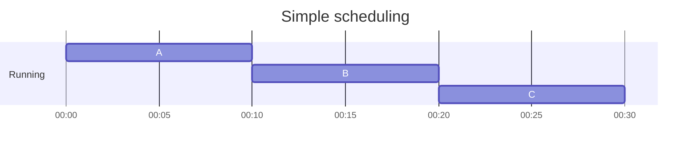

평균 turnaround time은 ${{10+20+30 \over 3} = 20}$

> ~~1. 각 job은 같은 시간 동안 실행~~ 가정 제거  
> 2. 모든 job은 동시에 도착(arrive)  
> 3. 한번 시작하면 모든 job은 완료될 때까지 실행  
> 4. 모든 job은 CPU만 사용(I/O 없음)  
> 5. 각 job의 run-time은 알고 있다  

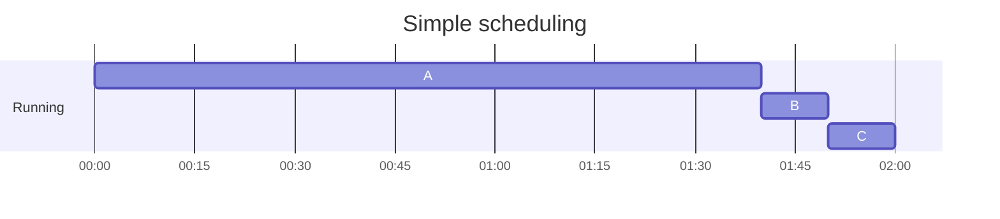

평균 turnaround time은 ${{100+110+120 \over 3} = 110}$

이렇게 상대적으로 짧은 시간 동안 자원을 소비하는 것이 자원을 크게 소모하는 것보다 나중에 대기열에 들어오는 것을 일반적으로 `convoy effect`라고 한다.

### Shortest Job First (SJF)

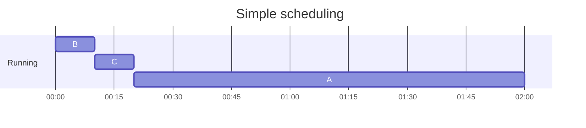

평균 turnaround time은 ${{10+20+120 \over 3} = 50}$

> ~~1. 각 job은 같은 시간 동안 실행~~ 가정 제거  
> ~~2. 모든 job은 동시에 도착(arrive)~~ 가정 제거  
> 3. 한번 시작하면 모든 job은 완료될 때까지 실행  
> 4. 모든 job은 CPU만 사용(I/O 없음)  
> 5. 각 job의 run-time은 알고 있다  

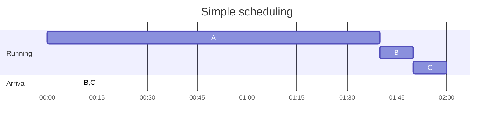

평균 turnaround time은 ${{100+(110-10)+(120-10) \over 3} = 103.33}$

### Shortest Time-to-Completion First (STCF)

> ~~1. 각 job은 같은 시간 동안 실행~~ 가정 제거  
> ~~2. 모든 job은 동시에 도착(arrive)~~ 가정 제거  
> ~~3. 한번 시작하면 모든 job은 완료될 때까지 실행~~ 가정 제거  
> 4. 모든 job은 CPU만 사용(I/O 없음)  
> 5. 각 job의 run-time은 알고 있다  

타이머 인터럽트와 컨텍스트 스위칭에 대해 논의했던 바와 같이, 스케쥴러는 B와 C가 도착하면 그와 비슷한 작업을 수행할 수 있다.

job A를 중단시킨(preempt) 후 다른 작업들을 실행시키고, 나중에 A를 다시 재개할 수 있다.

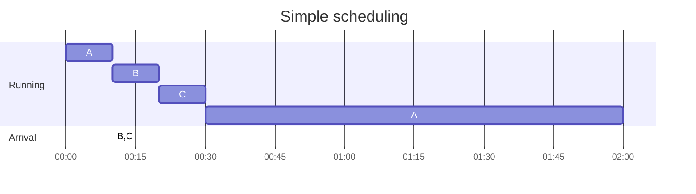

`SJF`에 선점(preemption)할 수 있도록 한 것을, `Shortest Time-to-Completion First (STCF)` 또는 `Preemptive Shortest Job First (PSJF)`라고 한다

평균 turnaround time은 ${{(120-0)+(20-10)+(30-10) \over 3} = 50}$

### A New Metric: Response Time

초기 배치 컴퓨터 시스템에서는 이 정도 알고리즘의 스케쥴링으로도 괜찮았다. 하지만, 시분할 머신(time-shared machine)의 등장으로 사용자들은 시스템과 상호작용할 수 있는 퍼포먼스를 기대하게 됐고, 그에 따라 새로운 지표인 `response time`이 등장하게 됨.

이를 job이 도작한 때부터 처음 스케쥴 되는 때까지의 시간으로 정의.

$T_{response} = T_{first\_run} - T_{arrival}$


- response time avg: 3.33
    - A: 0  (00:00 도착, 00:00 스케쥴)
    - B: 0  (00:10 도착, 00:10 스케쥴)
    - C: 10 (00:10 도착, 00:20 스케쥴)

### Round Robin

> what RR is doing is stretching out each job as long as it can, by only running each job for a short bit before moving to the next.

job을 완료할 때까지 실행시키는 대신, 시간 할당량(time slice, 또는 scheduling quantum 시간 양자) 동안 job을 실해이키고 실행 큐의 다른 job을 실행

시간 할당량의 길이는 timer-interrupt 기간의 곱이어야 한다. 따라서 timer-interrupt가 10ms라면, 시간 할당량은 10ms, 20ms...여야 한다.

시간 할당량이 1초인 경우 작업들을 빠르게 순환(cycle)

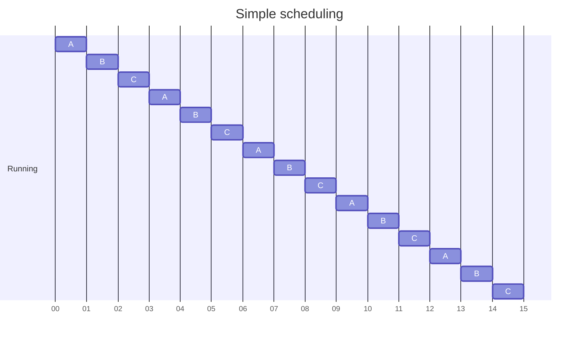

시간 할당량이 짧을수록 `response time` 지표상의 성능이 더 좋아지지만, context switching 비용이 전체 성능을 지배하게 된다

따라서 시간 할당량은
1. 컨텍스트 스위칭 비용을 분산(**amortize**) 시킬만큼 길되,
2. 너무 길어서 시스템이 응답하지 못할 정도는 아니게 해야 한다

가령 시간 할당량 10ms에 context switching 비용이 1ms라면, 10%의 시간이 컨텍스트 스위칭에 사용되고 낭비된다. 이를 분산하기 위해 만약 시간 할당량을 100ms로 늘린다면, 1%의 시간이 컨텍스트 스위칭에 사용되고 시간 할당량의 비용이 분산된다.

시간 할당량이 1s이고, 실행 시간이 각 5초인 A, B, C 세 프로그램이 RR로 스케쥴링될 때,
A는 13초, B는 14초, C는 15초에 끝나고, 평균 14초가 소요되는데, 처리량 지표에서는 상당히 좋지 않다.

만약 FIFO라면, 각각 5초, 10초, 15초에 끝나고, ${5 + 10 + 15 \over 3} = 10$ 초가 된다.

불공정하게 시간 배분
-> 더 짧은 시간의 job을 먼저 실행하여 처리 시간 지표에서 성능 향상
-> 하지만 응답 시간 지표에서 성능 하락

공정하게 시간 배분
-> 응답 시간 지표에서 성능 향상
-> 하지만 처리 시간 지표에서 성능 하락

### Incorporating I/O

> ~~1. 각 job은 같은 시간 동안 실행~~ 가정 제거  
> ~~2. 모든 job은 동시에 도착(arrive)~~ 가정 제거  
> ~~3. 한번 시작하면 모든 job은 완료될 때까지 실행~~ 가정 제거  
> ~~4. 모든 job은 CPU만 사용(I/O 없음)~~ 가정 제거  
> 5. 각 job의 run-time은 알고 있다  

A: 50ms of CPU, and I/O per 10ms
B: 50ms of CPU only
I/O: 10ms

1. STCF & I/O 고려하지 않는 경우
A와 B의 실행 실행 시간이 같으므로 다른 프로그램을 선점하지 않게 된다. 이때 A가 먼저 실행되면, 10ms마다 I/O가 실행되어 실제로는 A만 90ms의 시간이 소요된다

```text
CPU     A       A       A       A       A   B   B   B   B   B
DISK        A       A       A       A
            20      40      50      80      100     120     140
```

2. STCF & I/O 고려하는 경우
A의 I/O per 10ms를 하나의 서브 job으로 본다면, STCF 정책에 따라 더 짧은 A의 10ms sub job을 실행하고, 그 작업이 끝나면 남은 B를 실행하고, 다시 A의 sub job을 실행하게 된다. 이렇게 함으로써 겹침(`overlap`)이 가능하고, I/O가 끝나길 기다리는 동안 다른 프로세스를 위해 CPU를 사용할 수 있다

```text
CPU     A   B   A   B   A   B   A   B   A   B
DISK        A       A       A       A
            20      40      50      80      100     120     140
```

각 CPU burst를 하나의 작업(job)으로 처리함으로써, 스케쥴러는 interactive한 프로세스가 자주 실행되도록 보장

### No More Oracle

> ~~1. 각 job은 같은 시간 동안 실행~~ 가정 제거  
> ~~2. 모든 job은 동시에 도착(arrive)~~ 가정 제거  
> ~~3. 한번 시작하면 모든 job은 완료될 때까지 실행~~ 가정 제거  
> ~~4. 모든 job은 CPU만 사용(I/O 없음)~~ 가정 제거  
> ~~5. 각 job의 run-time은 알고 있다~~ 가정 제거  

실제로는 OS가 각 작업의 시간을 아는 경우는 드물다. OS가 미래를 볼 볼 수는 없기 때문이다.

이를 해결하기 위해 최근 과거를 사용하여 미래를 예측하는 스케쥴러를 알아보도록 할 것이다. 이는 multi-level feedback queue(MLFQ)로 알려져 있다.

## Scheduling: The Multi-Level Feedback Queue

1. optimize turnaround time
2. minimize response time

### MLFQ: Basic Rules

- has a number of distinct **queues**, each assigned a different **priority level** to decide which job should run at a given time
    > Rule 1:  
    > $\text{if }{Priority(A) \gt Priority(B)}\text{, then run A}$
- if multiple jobs with same priority, round-robin scheduling among those jobs
    > Rule 2:  
    > $\text{if }{Priority(A) = Priority(B)}\text{, A \& B run in Round Robin}$

**how the scheduler sets priorities?**
-> varies the priority of a job based on its *observed behavior*

만약 어떤 작업이:
1. 계속 CPU 사용을 포기하고 입력을 기다린다면? 우선순위를 높여서 응답 속도를 높인다
2. 오랜 시간 집중적으로 CPU를 사용한다면? 우선순위를 낮춘다

### Attempt #1: How To Change Priority

> Rule 3:  
> When a job enters the system, it is placed at the highest priority
>
>  
> Rule 4a:  
> If a job uses up an entire time slice while running, its priority is reduced  
>
>
> Rule 4b:  
> If a job gives up the CPU before the time slice is up, it stays at the same priority level

#### Example 1: A Single Long-Running Job

```mermaid
gantt
    dateFormat SS
    axisFormat %L
    title Simple scheduling
    section Priority
    Queue2: q2, 00, 10ms
    Queue1: q1, after q2, 10ms
    Queue0: q0, after q1, 180ms
```

시간 할당량이 10ms일 때 작업이 해당 시간 할당량 안에 끝나지 않는 경우, 우선순위가 Queue2 -> Queue1 -> Queue0 순서로 점차 낮아진다.

#### Example 2: Along Came A Short Job

```mermaid
gantt
    dateFormat SS
    axisFormat %L
    title Along Came An Interactive Job
    section Priority
    B arrival: b_arrival, 10, 10ms
    Queue2: q2, 00, 10ms
    B in Queue2: b_q2, after b_arrival, 10ms
    Queue1: q1, after q2, 10ms
    Queue0: q0_1, after q1, 80ms
    Queue0: q0_2, after b_q2, 120ms
```

#### Example 3: What About I/O?

만약 iterfactive 작업이 자주 발생한다면? 1ms 정도만 CPU를 필요로 하는 경우, *Rule 4b* 규칙에 따라 이 작업은 항상 가장 높은 우선순위의 큐에 위치하게 된다.

#### Problems With Our Current MLFQ

1. **starvation**
    - too many interactive jobs -> consume all CPU time
    - long running jobs will never receive CPU time(starve)
2. game the scheduler
    - sneaky to trick the scheduler into giving you more than your fair share of the resource.
    - 시간 할당량 지나기 전에 I/O 작업 요청하고 CPU 양도 -> 계속 높은 우선순위의 큐에 남아있을 수 있다
3. program may change its behavior over time
    - long running job -> interactive job

### Attempt #2: The Priority Boost

> Rule 5:  
> After some time period *S*, move all the jobs in the system to the topmost queue.

두 개의 문제 해결 가능
~~1. **starvation**~~
~~3. program may change its behavior over time~~

```text
// w/o Priority Boost
Q2  A                   B   C   B   C   B   C

Q1      A

Q0          A   A   A  -starvation-
    10  20          100
```

```text
// w/ Priority Boost per `S`(e.g 50ms)
Q2  A                   B   C   A   B   C   A   B   C   A
                                ^           ^           ^
Q1      A

Q0          A   A   A  
    10  20          100
```

Q: **what should S be set to?** voo-doo constants
너무 길면 long running job은 기아 상태에 빠지고, 너무 짧으면 interactive 작업이 CPU를 적절하게 사용할 수 없게 된다

### Attempt #3: Better Accounting

> ~~Rule 4a:  
> If a job uses up an entire time slice while running, its priority is reduced~~  
> ~~Rule 4b:  
> If a job gives up the CPU before the time slice is up, it stays at the same priority level~~

```text
// w/o Gaming Tolerance
Q2  A        BBBBBBB BBBBBBB BBBBBBB

Q1      A           

Q0          A       A       A
```

각 프로세스가 해당 우선순위 레벨에서 어느 정도의 시간 할당량을 사용했는지 잊는 대신, 스케쥴러는 이를 계속 추적한다. 어떤 프로세스가 일단 그 할당량을 사용했다면, 다음 우선 순위 큐로 강등(demote)시킨다

> Rule 4:  
> Once a job uses up its time allotment at a given level, ts priority is reduced

```text
// w/ Gaming Tolerance
Q2  A           B

Q1      A         B

Q0          A       A   B   A   B   A   B
```

### Tuning MLFQ And Other Issues

1. **parameterize**
    - how many **queues** should there be?
    - How big should the **time slice** be per queue
    - How often should **priority be boosted**

어떤 시스템은 우선순위 설정하는 데 도움을 주기도 한다. `nice` 라는 CLI 사용하면 작업의 우선순위를 높이거나 낮출 수 있다.

### 요약

> Rule 1:  
> $\text{if }{Priority(A) \gt Priority(B)}\text{, then run A}$  
>
>
> Rule 2:  
> $\text{if }{Priority(A) = Priority(B)}\text{, A \& B run in Round Robin}$  
>
>
> Rule 3:  
> When a job enters the system, it is placed at the highest priority
>
>
> Rule 4:  
> Once a job uses up its time allotment at a given level, ts priority is reduced  
>
>
> Rule 5:  
> After some time period *S*, move all the jobs in the system to the topmost queue.

- 규칙 4a, 4b는 gaming the scheduler 막기 위해 프로세스의  할당량을 추적하고, 할당량을 다 사용했다면 우선 순위를 낮추도로록 규칙을 변경한다
- interactive 작업만 여럿 생길 경우 길게 이뤄지는 작업이 기아 상태에 빠질 수 있으므로, priority boost를 준다

## Scheduling: Proportional Share(Lottery Scheduling)

### 9.1 Basic Concept: Tickets Represent Your Share

> `ticket`은 프로세스가 받아야 하는 자원의 공유를 나타는 데 사용

- 가령 `A`가 75 티켓, `B`가 25 티켓이면, 각각 75%, 25%의 CPU를 받게 된다
- 수시로 추첨(by holding a lottery every so often)을 통해 스케쥴링
    - 즉, 매 `time slice`마다
- 장점
    - LRU에서 순환하는 순차 워크로드 경우 최악의 퍼포먼스가 나올 수 있는데 이런 최악의 경우가 없다는 점
    - 모든 프로세스 자원 할당 히스토리를 트래킹하는 것보다 더 적은 상태 추적이 필요하기에 경량이라는 점
    - 난수 생성이 꽤 빠르다는 점

### 9.2 Ticket Mechanisms

> `ticket currency`(티켓 통화)는 사용자가 티켓을 자체적인 통화(currency)로 할당할 수 있도록 해준다. 이 각자의 통화(currency)로 할당된 티켓은 시스템에 의해 올바른 전역 값(correct global value)로 변환된다

- 가령 사용자 `A`와 `B`가 각각 100개의 티켓을 받고, `A`는 `A`의 통화(currency)로 두 개의 `A1`(500), `A2`(500) 작업 실행하고, `B`는 `B1`(10)이라는 하나의 작업 실행할 경우
    - 시스템은 `A`의 통화로 각 500 티켓을 가진 `A1`과 `A2`의 할당량을 전역 통화(global currency)의 50 티켓으로 변환한다
    - 비슷하게 `B1`의 10 티켓은 100 타켓으로 변환한다

> `ticket transfer`(티켓 양도)는 프로세스가 잠시 티켓을 다른 프로세스에 넘기는 것을 의미한다.

- 클라이언트의 속도를 높이기 위해 클라이언트를 위해 서버가 일하도록 서버로 메시지를 보내는 클라이언트/서버 설정 경우 유용하다

> `ticket inflation`로 프로세스가 가진 티켓의 수를 늘리거나 줄일 수 있다.

- 프로세스가 서로 신뢰할 수 없는 경우
    - 하나의 탐욕적인 프로세스가 자신에게 엄청난 양의 티켓을 주고 머신을 점유할 수 있기 때문에 인플레이션이 의미가 없다.
- 프로세스가 서로 신뢰할 수 있는 그룹인 경우
    - 어떤 프로세스가 CPU가 더 필요하다는 것을 알면, 다른 프로세스와의 커뮤니케이션 없이 그 필요를 시스템에 반영하기 위해 티켓을 부스트할 수 있다.

### 9.3 Implementation

- 구현에 필요한 사항
    1. 당첨 티켓을 고르기 위한 좋은 난수 생성기
    2. 시스템의 프로세스 트래킹하기 위한 자료 구조(가령 list)
    3. 전체 티켓 수

[src/chapters/process/lottery.rs](../src/chapters/process/lottery.rs) 참고

### 9.4 An Example

- 같은 수의 티켓과 같은 런타임(`R`)을 갖는 경우
- lottery 스케쥴링 때문에 한 작업이 다른 작업 전에 끝날 수 있는데, 이 차이를 정량화 하기 위해 간단한 `fairness metric`(`F`) 정의
    - $F = {\text{the time 1st job completed}\over\text{the time 2nd job completed}}$
    - $R = 10$, 첫번째 작업이 10에 종료, 두번째 작업이 20에 종료
    - $F = {10 \over 20} = 0.5$
    - 두 작업이 거의 동시에 끝날수록, `F` 값은 1에 가까워지고, 그 값이 1이면 완벽하게 공정함을 의미
- 작업 길이가 매우 길지 않은 경우, 평균적인 공정성은 상당히 낮을 수 있다. 작업이 상당한 time slice 동안 실행되어야 원하는 만큼의 공정성 결과에 도달하게 된다.

### 9.5 How To Assign Tickets?

- One approach is to assume that the users know best -> BUT it really doesn’t tell you what to do
- 그래서 티켓 할당 문제는 여전히 남아 있다.

### 9.6 Stride Scheduling

- 무작위 스케쥴러는 대략적으로 올바른 스케쥴러를 제공하지만, 특히 짭은 시간 단위에서는 정확하게 옳은 비율(proportions)을 전달하지 못할 수 있다
- Each job in the system has a **`stride`**
    - 티켓 수에 반비례(inverse in proportion to the number of tickets)하여 계산된 값
    - A: 100, B: 50, C: 250 경우
        - 어떤 큰 수를 각 티켓으로 나눈다.
        - 만약 그 큰 수가 10,000이라면, A's stride: 100, B's stride: 200, C's stride: 40 된다
        - 이 100, 200, 40을 `stride`라 부른다
- 프로세스가 실행될 때마다 `stride` 값만큼 프로세스에 대한 카운터(`pass counter`, `pass` 값이라 불린다)를 증가시켜서 global progress를 추적한다
- `stride`와 `pass`를 사용해서 스케쥴러는 어떤 프로세스가 다음에 실행되어야 하는지 결정
- 언제든지, `pass` 값이 가장 작은 프로세스를 선택

```pseudocode
curr = remove_min(queue); // pick client with min pass
schedule(curr); // run for quantum
curr->pass += curr->stride; // update pass using stride
insert(queue, curr); // return curr to queue
```

- 간단한 시나리오
    - A(tickets: 100, stride: 100, pass: 0), B(tickets: 50, stride: 200, pass: 0), C(tickets: 250, stride: 40, pass: 0)
        - 임의로 A 실행 -> A(tickets: 100, stride: 100, pass: 100)
        - B 실행 -> B(tickets: 50, stride: 200, pass: 200)
        - C 실행 -> C(tickets: 250, stride: 40, pass: 40)
        - C 실행 -> C(tickets: 250, stride: 40, pass: 80)
        - C 실행 -> C(tickets: 250, stride: 40, pass: 120)
        - A 실행 -> A(tickets: 100, stride: 100, pass: 200)
        - C 실행 -> C(tickets: 250, stride: 40, pass: 160)
        - C 실행 -> C(tickets: 250, stride: 40, pass: 200)
    - C 5번 실행, A 두 번 실행, B 한 번 실행

> `Lottery scheduling` achieves the proportions probabilistically over time;
>
> `Stride scheduling` achieves the proportions probabilistically right at the end of each scheduling cycle.

그렇다면 왜 `Lottery scheduling` 사용? `Stride scheduling`와 달리 전역 상태(global state)가 없기 때문. 만약 `Stride scheduling`에서 새로운 프로세스가 진입하면, 이 프로세스의 `pass` 카운터는 0이 되어야 할까? 만약 그렇다면 CPU를 독점할 수 있다. `Lottery scheduling`은 프로세스마다 글로벌 상태가 없으므로 해당 프로세스가 얼만큼 티켓을 갖고 있든 새로운 프로세스를 간단하게 추가할 수 있고, 얼마나 많은 전체 티켓을 가졌는지 추적하기 위해 단일 글로벌 변수를 업데이트하면 된다. 그리고 그 다음부터는 그대로 진행하면 된다.

### 9.7 The Linux `Completely Fair Scheduler` (`CFS`)

- 특징
    - a highly efficient and scalable
    - it aims to spend very little time making scheduling decisions(even after aggressive optimization, scheduling uses about 5% of overall datacenter CPU time in a study of Google datacenters, Kanev et al)

#### Basic Operation

목표
- 모든 경쟁하는 프로세스들에 고르게 CPU를 공정하게 분배

virtual runtime (`vruntime`), counting-based technique
- 각 프로세스 실행마다 `vruntime`를 누적시킨다. 대부분의 경우 각 프로세스의 `vruntime`은 physical (real) time에 비례하여 같은 비율로 증가
- `CFS`는 가장 낮은 `vruntime`의 프로세스를 선택

`CFS`의 tension
    - `CFS`가 자주 스위칭 -> 공정성 증가 -> 퍼포먼스 하락
    - `CFS`가 덜 스위칭 -> 단기(near-term) 공정성 하락 -> 퍼포먼스 증가

`CFS`는 이런 텐션을 여러 제어 파라미터로 관리
- `sched_latency`
    - 어떤 프로세스가 스위칭 되기 전에 얼마나 실행되어야 하는지 결정.
    - 보통 48 milliseconds.
    - `CFS`는 이 값을 프로세스 개수 n으로 나눠서 프로세스에 대한 time slice 결정.
    - 프로세스가 종료한다면, 프로세스에 대한 time slice는 다시 계산
- `min_granularity`
    - 최소한 보장되는 프로세스 실행 시간. 프로세스가 너무 많은 경우 잦은 스위칭 발생 대비.
    - 일반적으로 6ms

#### Weighting (Niceness)

`nice` level of a process
- 기본값 0, -20 ~ +19 사이의 값으로 설정 가능
- 양수는 낮은 우선순위, 음수는 높은 우선순위

`CFS`는 각 프로세스의 `nice` 값을 `weight`와 맵핑

```c
static const int prio_to_weight[40] = {
    // preserves CPU proportionality ratios when the difference in `nice` values is constant.
    // 즉, `A`가 -5, `B`가 0(차이가 5)이거나 `A`가 5, `B`가 10(차이가 5)일 때 모두
    // CPU 비례 비율이 일정하다
    // - 3121/1024 = 3.0478515625
    // - 1025/335 = 3.056716417910448
    // - 335/110 = 3.045454545454545

    /* -20 */ 88761, 71755, 56483, 46273, 36291,
    /* -15 */ 29154, 23254, 18705, 14949, 11916,
    /* -10 */ 9548, 7620, 6100, 4904, 3906,
    /* -5 */ 3121, 2501, 1991, 1586, 1277,
    /* 0 */ 1024, 820, 655, 526, 423,
    /* 5 */ 335, 272, 215, 172, 137,
    /* 10 */ 110, 87, 70, 56, 45,
    /* 15 */ 36, 29, 23, 18, 15,
};
```

##### time slice 계산

n 개의 프로세스가 있을 때, 우선순위를 고려하여 time slice 계산

$$\text{timeSlice}_{k} = {\text{weight}_{k}\over\sum_{i=0}^{n-1}\text{weight}_{i} \times \text{schedLatency}}$$

예를 들면, 다음과 같이 된다
- `A`
    - 프로세스는 중요해서 우선순위를 높인다(nice: -5)
    - $weight_{A}$는 위 테이블의 `3121`임을 의미
- `B`
    - 프로세스는 중요치 않아서 기본 우선순위 유지(nice: 0)
    - $weight_{B}$는 위 테이블의 `1024`임을 의미

이를 계산하면, 두개의 프로세스 가정하고 있으므로, 분모는 4145가 되므로

$$
{3121\over\sum_{i=0}^{n-1}\text{weight}_{i}}={3121\over4145}\approx{0.75}
$$

`A` 프로세스의 time slice는 `sched_latency`(48ms)의 3/4, 36ms가 된다
`B` 프로세스의 time slice는 반대로 1/4, 12ms가 된다

##### `vruntime` 계산

time slice 계산을 일반화하는 것 외에도, `CFS`가 `vruntime`을 계산하는 방식도 반드시 조정해야 한다.

$$\text{vruntime}_{i} = {\text{vruntime}_{i} + {\text{weight}_{0}\over\text{weight}_{i}}\times\text{runtime}_{i}}$$

기본 우선순위(${\text{weight}_{0}=1024}$)를 해당 프로세스의 $\text{weight}_{i}$로 나눠서 실제 실행 시간 $\text{runtime}_{i}$에 곱하여,우선순위가 높을수록 마치 짧게 실행된 것처럼 만든다.

따라서 위의 예제에서 `A` 프로세스는 `B` 프로세스보다 1/3의 비율로 `vruntime`을 누적시키게 된다.

#### Using Red-Black Trees

- 다음 프로세스를 가능한 한 빨리 찾아야 하므로, 단순 리스트로는 확장되지 않는다.
- `CFS`는 `red-black tree`에 프로세스 유지
    - balanced tree의 일종
    - binary tree와 달리, 추가적인 작업을 통해 낮은 깊이를 유지
    - 로그 시간(logarithmic time) 내에 작업 수행 보장
- 모든 프로세스를 유지하는 것은 아니다
    - 실행중이거나 실행할 수 있는 프로세스만 유지
    - I/O 기다리거나, 네트워크 패킷 도착을 기다리기 위해 sleep 상태에 들어가면 트리에서 제거하고 다른 곳에서 추적

10개의 `vruntime`: 1, 5, 9, 10, 14, 18, 17, 21, 22, 24

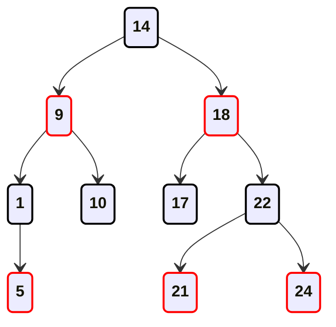

같은 값들을 리스트가 아닌 red-black tree에 유지하면 대부분의 작업이 더 효율적이게 된다
프로세스가 `vruntime`에 따라 정렬(작은 값은 좌측, 큰 값은 우측)되고, 대부분의 작업이 로그 시간 $O(\log{n})$ 내에 수행된다.

#### Dealing With I/O And Sleeping Processes

오랜 시간 동안, 가령 10초 정도 sleep 상태에 빠져있던 프로세스가 깨어난다면, 그 다음 10초 동안 CPU를 독점하게 되고, 다른 프로세스는 기아 상태에 빠지게 된다. 이 경우 `CFS`는 해당 프로세스가 깨어날 때 `vruntime`를 변경함으로써 이런 문제를 처리한다. `CFS`는 레드 블랙 트리 상의 가장 작은 값을 찾아서 해당 프로세스의 `vruntime`로 설정한다.

기아 상태를 피할 수 있지만, 비용이 들지 않는 것은 아니다. 짧은 시간 동안 잠드는 작업들은 종종 CPU의 공평한 몫(fair share)을 받을 수 없게 된다.

## Multiprocessor Scheduling (Advanced)

> TODO: 우선 읽기만 하고, 정리는 나중에...

- `multiprocessor`
    - `multicore` processor
    - `multicore`? multiple CPU cores are packed onto a single chip
    - 단일 CPU를 너무 많은 전력을 소모하지 않으면서 더 빠르게 만들기 어려워졌을 때 유명해지기 시작

문제는, 일반적인 애플리케이션은 단일 CPU 사용해서, CPU를 추가한다고 애플리케이션이 더 빨라지는 건 아니었다.
이를 해결하기 위해서는 `threads` 사용하여 병렬(`parallel`)로 실행되도록 애플리케이션 재작성이 필요

multi threaded 애플리케이션은 작업을 여러 CPU에 분산시킬 수 있고, CPU 자원이 추가되면 더 빠르게 실행될 수 있다.

그러면 OS에 대해 생기는 문제가 multiprocessor scheduling이다

### 10.1 Background: Multiprocessor Architecture

단일 CPU 하드웨어와 멀티 CPU 하드웨어의 근본적인 차이점은 하드웨어 **캐시**의 사용과 멀티 프로세서 간의 데이터 공유가 어떻게 이뤄지는가에 있다.

캐시는 지역성(locality)이 기반한다
- 시간 지역성(temporal locality)
- 공간 지역성(spatial locality)

여러 CPU와 단일 공유 메인 메모리 경우 캐시 일관성(cache coherence) 문제 발생
1. CPU1이 A 주소에서 데이터 D를 읽으려 함
2. D가 캐시에 없어서 시스템은 메인 메모리에서 가져온다
3. 캐시 A 주소의 값을 D'로 수정. 메인 메모리까지 수정하는 건 느리기 때문에 시스템은 이를 나중에 수정
4. OS가 프로그램 실행을 멈추고 CPU2로 이동시킨다
5. A 주소에서 데이터 D를 읽으려 하지만 캐시에 없어서 메인 메모리에서 D' 대신 D를 가져온다 -> 문제 발생

기본적인 해결책은 하드웨어가 제공. 메모리 접근을 모니터링해서 옳은 일이 일어나는 것을 보장하고 단일 공유 메모리 view가 보존되도록 보장

버스 시스템에서 이를 위한 한 방법은 **bus snooping**이라는 오래된 테크닉 사용하는 것
1. 각 캐시의 cache controller는 메인 메모리에 연결된 bus를 관찰하며 메모리 업데이트를 주시
2. CPU가 캐시에 유지하고 있는 데이터 항목에 대한 수정을 확인하면, 변경 사항을 알리고, 캐시를 무효화시키거나 업데이트한다

Write-back caches는 보다 더 복잡한 작업이 이뤄지지만, 기본적인 작동은 위와 같다

### 10.2 Don’t Forget Synchronization

여러 CPU를 통해 공유 데이터 항목 또는 구조에 접근할 때,
1. 락(lock) 같은 mutual exclusion primitives 사용하여 정확성을 보장
2. 또는 lock-free 자료 구조를 구현

```rs
// rustlib/src/rust/library/alloc/src/collections/linked_list.rs
/// Removes and returns the node at the back of the list.
#[inline]
fn pop_back_node(&mut self) -> Option<Box<Node<T>>> {
    // This method takes care not to create mutable references to whole nodes,
    // to maintain validity of aliasing pointers into `element`.
    self.tail.map(|node| unsafe {
        let node = Box::from_raw(node.as_ptr());
        self.tail = node.prev;

        match self.tail {
            None => self.head = None,
            // Not creating new mutable (unique!) references overlapping `element`.
            Some(tail) => (*tail.as_ptr()).next = None,
        }

        self.len -= 1;
        node
    })
}
```

## The Abstraction: Address Spaces

### 13.1 Early Systems

- OS는 물리 메모리 주소 0부터 시작하는, 어떤 루틴의 집합(사실상 library)
- 프로그램(프로세스)는 나머지 물리 메모리 사용

### 13.2 Multiprogramming and Time Sharing

- 머신이 비싸지면서 주어진 시간에 여러 프로세스가 실행할 준비가 되고, I/O 동안 다른 프로세스로 스위칭하는 `multiprogramming` 등장
- 배치 컴퓨팅의 한계 때문에 `time sharing` 등장하고, `interactivity` 개념이 중요해짐
- 여러 프로그램이 메모리에 동시에 상주헤가 되면서, `protection`이 중요해짐

```text
0KB     -- Start of physical memory -- 
    OS(code, data, etc)
64KB    
//////// (free) ////////
128KB   
    Process C(code, data, etc)
192KB   
    Process B(code, data, etc)
256KB   
//////// (free) ////////
320KB   
    Process A(code, data, etc)
384KB   
//////// (free) ////////
448KB   
//////// (free) ////////
512KB   -- End of physical memory -- 
```

### 13.3 The Address Space

> `address space`?  
> - easy to use abstraction of physical memory  
> - the running program’s view of memory in the system  

`address space`에는 무엇이 있어야 할까?
- code: 명령(instruction)들
- stack: 함수 호출 체인에서 어디에 있는지 추적, 지역 변수 할당, 루틴들에 파라미터 전달 값을 리턴
- heap: C의 `malloc()`, java와 C++의 `new`로 인스턴스 생성 등 동적으로 할당되고 사용자가 관리하는 메모리를 위해 사용

32비트 주소 공간 표현이 힘들고, 수식이 복잡해지므로 16비트 주소 공간으로 표현해보자면,

```mermaid
0KB |--------------------------------|
    |          Program Code          |
1KB |--------------------------------|
    |              Heap              |
2KB |--------------------------------|
    |                ↓               |
    |                                |
    |             (free)             |
    |                                |                 
    |                ↑               |                 
15KB|--------------------------------|
    |              Stack             |
16KB|--------------------------------|
```

- this placement of `stack` and `heap` is just a *convention*;
    - you could arrange the address space in a different way if you’d like
    - when multiple `threads` co-exist in an address space, no nice way to divide the address space like this works anymore
- `virtualizing memory`(VM): the OS, in tandem with some hardware support, will have to make sure the load doesn’t actually go to physical address 0

### 13.4 Goals

- `transparency`(it means "one that is hard to notice")
    - in a way that is **invisible** to the running program
    - the program behaves as if it has its own private physical memory
    - multiplex memory among many different jobs
- `efficiency`
    - time
    - space
- `protection`
    - isolation

> if you print out an address in a program, it’s a virtual one, an illusion of how things are laid out in memory; only the OS (and the hardware) knows the real truth.

## Interlude: Memory API

### 14.1 Types of Memory

#### stack

- managed implicitly by the compiler, so sometimes called **automatic** memory
    - 호출 시 stack에 공간 생성
    - return 시 deallocate

```rs
pub fn func() -> () {
    let x: i32; // declares an integer on the stack
} // deallocate the memory
```

#### heap

- all allocations and deallocations are *explicitly* handled by programmer
- 컴파일러는 개발자가 선언한 변수와 타입을 보고 해당 타입에 대한 공간을 생성해야 한다는 것을 알고, heap에 해당 타입에 대한 공간을 요청하면, ㅇ 루틴은 성공 시 그 공간에 대한 주소를 반환

### 14.2 The `malloc()` Call

```rs
let x_ptr = libc::malloc(mem::size_of::<i32>());
let d_ptr = libc::malloc(mem::size_of::<f64>());
// [test_malloc] i32_size_t is 4, x_ptr is 0x12be06c90
// [test_malloc] f64_size_t is 8, d_ptr is 0x12be06ca0
```

`mem::size_of::<타입>`은 *compile time*의 작업으로, 실제 크기는 컴파일 시에 알게 된다. `size_of`는 컴파일 타임에 각각 4, 8로 대체된다.

함수 호출은 런타임에 발생하므로, `size_of`는 함수 호출이 아닌 연산자(operator)로 올바르게 여겨진다.

### The `free()` Call

```rs
libc::free(x_ptr);
libc::free(d_ptr);
```

할당됐던 지역의 사이즈가 직접 매개변수로 들어가지 않고, 메모리를 할당했던 라이브러리 자체적으로 트래킹하여 처리한다

### 14.4 Common Errors

#### Forgetting To Allocate Memory

- segmentation fault 발생할 수 있다

#### Not Allocating Enough Memory

- `buffer overflow`로 불리기도 한다
- 충분한 메모리를 할당하지 않으면, 다른 메모리 공간을 덮어쓰게 되면서 충돌이 발생할 수 있다.

#### Forgetting to Initialize Allocated Memory

- 새로 할당된 메모리에 어떤 값을 채워넣지 않는다면 `uninitialized read`를 마주치게 된다,
- 만약 초기화하지 않는다면, 그 메모리 공간에 뭐가 있을지 누구도 알 수 없다. 왜일까?
    - `malloc()`을 사용하면 그 공간을 예약받는 것과 다름이 없다
    - 하지만 그 공간에는 전에 사용하던 어떤 값이 남아 있을 수 있으며, 따라서 해당 메모리 공간이 zero나 null로 시작한다는 보장을 할 수가 없다

#### Forgetting To Free Memory

- `memory leak`으로 인해 out of memory(OOM) 발생
- 단기간 실행되고 exit 되는 프로그램 경우 `free`로 메모리를 해제하지 않더라도 결국 프로세스가 죽으면 OS는 할당된 페이지들을 정리하게 되어 메모리 누수가 발생하지 않게 되겠지만, 이는 개발자에게 나쁜 습관이 된다.

#### Freeing Memory Before You Are Done With It

- `dangling pointer`(댕글링, 허상 포인터)
- 작업 완료 전에 `free()` -> `malloc()`으로 재할당 -> 완료되지 않은 작업에서 접근 -> 에러 발생 가능

#### Freeing Memory Repeatedly

- 두 번 `free`할 수 있는데, 이 결과는 정해진 게 없다. 라이브러리가 혼란에 빠질 수 있고, 모든 종류의 이상한 일이 발생할 수 있다.

#### Calling `free()` Incorrectly

#### 요약

- 메모리로 인한 에러가 자주 발생하므로, 코드의 문제를 찾는 데 도움을 주는 여러 툴들이 개발됐다. 가령 `purify`, `valgrind` 같은 툴로 이상 여부를 체크할 수 있다.

### 14.5 Underlying OS Support

- `malloc()`과 `free()`은 시스템 콜이 아니라, 라이브러리 콜
- malloc 라이브러리는 가상 주소 공간의 공간을 관리하지만, 라이브러리 그 자체는 더 많은 메모리를 요청하거나 메모리를 반환하는 어떤 시스템 콜들 위에 빌드 되어 있다.
    - `brk`: 프로그램의 `break`, heap의 종료 지점을 변경시키는 데 사용된다
    - `sbrk`
    - `mmap`: 프로그램에  `swap space`와 연관된 anonymous memory region 생성할 수 있고, heap처럼 다룰 수 있다

### 14.6 Other Calls

- `calloc`: 메모리를 할당하고 반환 전에 제로로 만든다
- `realloc`: 메모리 공간이 더 필요한 경우, 이전 region을 더 큰 메모리 공간으로 복사하고, 새로운 공간에 대한 포인터를 반환

## Mechanism: Address Translation

- `limited direct execution` (or `LDE`)
    - for the most part, let the program run directly on the hardware;
    - however, at certain key points in time (such as when a process issues a system call, or a timer interrupt occurs), arrange so that the OS gets involved and makes sure the “right” thing happens.
    - 실행중인 프로그램을 방해하지 않으면서 효율적인 가상화를 제공하고, 중요한 순간에 개입(**interposing**)함으로써 하드웨어에 대한 제어를 유지

> **INTERPOSITION**  
> In virtualizing memory, the hardware will *interpose* on each memory access, and *translate* each virtual address issued by the process to a physical address where the desired information is actually stored.  
> One of the usual benefits of such an approach is **transparency**; the interposition often is done *without changing the interface of the client*, thus requiring no changes to said client.

- 메모리 가상화도 이와 같은 전략을 따른다
    - Efficiency
        - 하드웨어 지원을 활용.
        - 처음에는 몇 개의 register였지만, 이제는 TLB, page-table 지원 등 복잡한 지원
    - Control
        - 어떤 애플리케이션도 그 자신의 메모리 메모리 외에는 접근할 수 없음
    - flexibility
        - 각 프로그램들이 원하는 방식대로 프로그램의 주소 공간을 사용할 수 있도록 하는 것
- LDE와 비슷한 접근 방식을 `hardware-based address translation` 또는 짧게 `address translation`이라고 한다
    - the **hardware**
        - *transforms each memory access* (e.g., an instruction fetch, load, or store), changing the virtual address provided by the instruction *to a physical address* where the desired information is actually located.
        - redirect application memory references to their actual locations in memory

### 15.1 Assumptions

> 1. user’s address space must be placed contiguously in physical memory  
> 2. the size of the address space is not too big, less than the size of physical memory  
> 3. each address space is exactly the same size.

### 15.2 An Example

```c
void func() {
    int x = 3000; // thanks, Perry.
    x = x + 3; // line of code we are interested in
    //...
}
```

```asm
// cargo asm --bin ostep ostep::main
    .globl    __ZN5ostep8chapters14virtualization6memory19address_translation16func_to_increase17h8171c6ddb07628f4E
    .p2align    2
__ZN5ostep8chapters14virtualization6memory19address_translation16func_to_increase17h8171c6ddb07628f4E:
Lfunc_begin92:
    .file    103 "/Users/rody/VscodeProjects/ostep" "src/chapters/virtualization/memory/address_translation.rs"
    .loc    103 2 0
    .cfi_startproc
    .loc    103 7 2 prologue_end
    mov    w0, #3003
    ret
```

```asm
// https://play.rust-lang.org/?version=stable&mode=debug&edition=2021
playground::main:
    subq    $4, %rsp
    movl    $3000, (%rsp)
    movl    $3003, (%rsp)
    addq    $4, %rsp
    retq
```

```asm
// from ostep book in x86 assembly
128: movl 0x0(%ebx), %eax ;load 0+ebx into eax
132: addl $0x03, %eax ;add 3 to eax register
135: movl %eax, 0x0(%ebx) ;store eax back to mem
```

- `ebx`: register
- `eax`: general-purpose register
- `movl`: "longword" move

```text
|   0kb   |----------------------|
|      128|movl 0x0(%ebx),%eax   |
|      132|addl 0x03, %eax       |
|      135|movl %eax,0x0(%ebx)   |
|   1kb   |                      |
|         |     Program Code     |
|   2kb   |----------------------|
|         |                      |
|   3kb   |         Heap         |
|         |                      |
|   4kb   |----------------------|
|         |                      |
|         |        (free)        |
|         |                      |
|   14kb  |----------------------|
|         |                      |
|         |                      |
|   15kb  |3000                  |
|         |         stack        |
|   16kb  |----------------------|
```

- to virtualize memory, the OS wants to place the process somewhere else in physical memory, not necessarily at address 0.

> how can we relocate this process in memory in a way that is **transparent** to the process?  
> How can we provide the *illusion of a virtual address space starting at 0*, when in reality the address space is located at some other physical address?

- again, `transparent` is...
    - process of relocating memory or providing a virtual address space is **invisible** or **not noticeable** to the running process
    - so, process is not aware of the actual physical memory addresses
    - it allows programs to operate with the illusion of a private and continuous address space without having to be concerned about the actual memory allocation and management details

### 15.3 Dynamic (Hardware-based) Relocation

- **`base` and `bounds`(also `limit`)** registers(referred to as `dynamic relocation`)
    - allow us to place the address space anywhere we’d like in physical memory
    - ensuring that the process can only access its own address space
    - about `bounds` registers:
        - it holds the *size* of the address space -> check the virtual address before adding the `base`
        - it holds the *physical address of the end of the address space* -> check the
- when a program starts running, the OS decides:
    1. where in physical memory it should be loaded
    2. and sets the `base` register to that value.

> physical address = virtual address + base

가령 만약 앞서 `func()` 코드 실행 위해서 OS가 32KB 물리주소에 프로세스 로드하기로 결정한 경우, `address translation` 과정은 다음과 같다

```asm
// from ostep book in x86 assembly
128: movl 0x0(%ebx), %eax ;load the value at address `0x0 + %ebx` into `%eax` register
132: addl $0x03, %eax ;add 3 to eax register
135: movl %eax, 0x0(%ebx) ;store eax back to mem
```

1. The instruction `128: movl 0x0(%ebx), %eax` is located at a virtual address 128.
2. When *the hardware* needs to fetch the instruction of *'program counter(PC) is set to 128'*,
    1. To get a physical address, *the hardware* adds the value *128* to the `base` register value of *32 KB (32,768)*, so the result iss *32,896*
    2. then fetches the instruction from that physical address
3. the processor begins executing the instruction
4. the process issues the load from virtual address 15KB
    1. *the processor* takes and again adds to the base register (32 KB)
    2. getting the final physical address of 47 KB
    3. and thus the desired contents

여기서 *the hardware*는 프로세서, 특히 프로세서 내의 메모리 관리 유닛([MMU](https://en.wikipedia.org/wiki/Memory_management_unit))를 의미

the processor will first check that the memory reference is within `bounds` to make sure it is legal. If a process generates a virtual address that is greater than the `bounds`, or one that is negative, the CPU will raise an exception, and the process will likely be terminated

#### Example Translations

> When a process with an address space of size 4 KB has been loaded at physical address 16 KB

| Virtual Address | Physical Address        |
|-----------------|-------------------------|
| 0               | → 16 KB                 |
| 1 KB            | → 17 KB                 |
| 3000            | → 19384                 |
| 4400            | → Fault (out of bounds) |

### 15.4 Hardware Support: A Summary

#### 하드웨어 요구 사항

1. two different CPU modes
    - `privileged mode`(`kernel mode`)
    - `user mode`
2. the `base` and `bounds` registers, part of the memory management unit (MMU) of the CPU
    - translate each address by adding the `base` value to the virtual address
    - check whether the address is valid
3. special instructions to modify the `base` and `bounds` registers,
4. the CPU must be able to generate **exceptions** when a user program tries to access memory illegally
5. **exception handler** by which OS must be able to tell hardware what code to run if exception occurs

### 15.5 Operating System Issues

Again, our assumptions are:

> 1. user’s address space must be placed contiguously in physical memory  
> 2. the size of the address space is not too big, less than the size of physical memory  
> 3. each address space is exactly the same size.

#### OS 책임 사항

1. Memory management
    - `free list` 탐색하여 새로운 프로세스 위한 메모리 할당하고 사용중이라고 표시
    - 종료된 프로세스로부터 메모리 회수하여 `free list`에 넣고 필요에 따라 관련 자료 구조 정리
    - `free list` 통한 메모리 관리
2. `base`, `bound` management
    - `base`와 `bound` 한쌍을 저장하고 있다가 컨텍스트 스위치 시 CPU에 설정
    - 특히 실행중인 프로그램 중지할 경우, `process structure` 또는 `process control block`(`PCB`) 같은 프로세스별 구조에 저장해야 한다
3. exception handling
    - 익셉션 발생 시 실행할 코드(boot time에 설치)

#### 주소 공간 relocation by OS

1. OS deschedules the process
2. OS copies the address space from the current location to the new location
3. OS updates the saved base register(in the `process structure`) to point to the new location

#### Limited Direct Execution (Dynamic Relocation) @ Boot and @ Runtime

1. At boot
    1. [OS]
        1. [OS] initialize trap table
    2. [H/W]
        1. [H/W] remember addresses of
            1. syscall handler
            2. timer handler
            3. illegal mem-access handler
            4. illegal instruction handler
    3. [OS]
        1. [OS] start interrupt timer
    4. [H/W]
        1. [H/W] start timer
        2. [H/W] interrupt CPU after X ms
    5. [OS]
        1. [OS] initialize process table
        2. [OS] initialize free list
2. At run
    1. [To run A Process]
        1. [OS]
            1. [OS] Create entry for process list
            2. [OS] Allocate memory for theprogram's code, data, stack, heap
            3. [OS] Load program into memory(executable into the allocated memory space)
            4. [OS] Set up the user stack with the program's arguments, `argv`
            5. [OS] Fill kernel stack with initial register and program counter(`PC`)
            6. [OS] allocate entry in process table
            7. [OS] alloc memory for process set `base`/`bound` registers
            8. [OS] return-from-trap (into A)
        2. [H/W]
            1. [H/W] restore registers of A
            2. [H/W] move to user mode
            3. [H/W] jump to A’s (initial) PC
        3. [Program]
            1. [Program] Process A runs: Fetch instruction
        4. [H/W]
            1. [H/W] translate virtual address
            2. [H/W] perform fetch
        5. [Program]
            1. [Program] Process A runs: Execute instruction
        6. [H/W]
            1. [H/W] if explicit load/store: ensure address is legal
            2. [H/W] translate virtual address
            3. [H/W] perform load/store
        7. [Program]
            1. [Program] Process A runs
        8. [H/W]
            1. [H/W] timer interrupt
            2. [H/W] save (A)regs → (A)kernal-stack
            3. [H/W] move to kernel mode
            4. [H/W] jump to trap handler
    2. [To run B Process]
        1. [OS]
            1. [OS] Handle the trap
            2. [OS] timer interrupt handler decides to switch from A-process to B-process
            3. [OS] Call `switch()` routine
            4. [OS] save (A)regs → to (A)process-structure in memory
            5. [OS] restore (B)regs ← from (B)process-structure in memory
            6. [OS] switch to (B)kernal-stack by changing the stack pointer(`switch context`)
            7. [OS] `return-from-trap` (into B)
        2. [H/W]
            1. [H/W] restore (B)regs ← (B)kernal-stack
            2. [H/W] move to user mode
            3. [H/W] jump to B’s PC
        3. [Program]
            1. [Program] Process B runs: Execute bad load
        4. [H/W]
            1. [H/W] Load is out-of-bounds;
            2. [H/W] move to kernel mode
            3. [H/W] jump to trap handler
        5. [OS]
            1. [OS] Handle the trap
            2. [OS] decide to kill process B
            3. [OS] deallocate B’s memory
            4. [OS] free B’s entry in process table

#### 고정 크기의 메모리 할당의 단점

프로세스가 사용하는 stack과 heap이 크지 않으면, 할당된 메모리를 낭비하는 내부 단편화(**internal fragmentation**) 발생 가능하다. 이번 챕터에서 살펴본 접근 방식상 프로세스가 메모리를 요청하면 고정된 크기의 블록이 프로세스에 할당되는데, 프로세스가 실제로 사용하는 것보다 할당된 메모리가 더 크면 내부 단편화 발생.

물리 메로리를 더 활용하고 **internal fragmentation**를 피하기 위해 **`segmentation`**라고 알려진 `base`와 `bound`의 약간의 일반화(a slight generalization) 시도

## Segmentation

### 16.1 Segmentation: Generalized `Base`/`Bounds`

> `segmentation`: just a contiguous portion of the address space of a particular length

three logically-different segments
- code
- stack
- heap

각 세그먼트를 물리 메모리의 서로 다른 부분에 할당하여 사용하지 않는 가상 주소 공간이 물리 메모리를 채우는 것을 피할 수 있다.

#### example translation

```text
|   0kb   |----------------------|
|         |                      | <<-- 100
|   1kb   |                      |
|         |     Program Code     |
|   2kb   |----------------------|
|         |                      |
|   3kb   |                      |
|         |                      |
|   4kb   |----------------------|
|         |                      | <<-- 4,200
|   5kb   |                      |
|         |         Heap         |
|   6kb   |                      |
|         |                      |
|   7kb   |----------------------|
|         |                      |
|         |        (free)        |
|         |                      |
|   14kb  |----------------------|
|         |                      |
|   15kb  |                      |
|         |         stack        |
|   16kb  |----------------------|
```

| Segment | Base | Size |
|---------|------|------|
| Code    | 32K  | 2K   |
| Heap    | 34K  | 3K   |
| Stack   | 28K  | 2K   |

- reference to virtual address 100?
    1. `base` + 100 = 32,768 + 100 = 32,868
    2. 100 < 2KB size, so within `bounds`
    3. issue the reference to physical memory address 32868

- an address in the *heap*, virtual address 4200?
    1. ~~`base` + 4,200 = 34,816 + 4200 = 39,016~~
    2. 4,200 - 4,096(where the heap starts) = 104 = *offset*
    3. `base` + 104(*offset*) = 34,816 + 104 = 34,920

- What if we tried to refer to an illegal address? **segmentation violation** or **segmentation fault**
    1. the hardware detects that the address is out of `bounds`
    2. traps into the OS
    3. termination of the offending process.

### 16.2 Which Segment Are We Referring To?

The hardware uses `segment registers` during translation.

#### explicit approach

chop up the address space into segments based on the top few bits of the virtual address

If we use the top two bits of our 14-bit virtual address to select the segment:
- `00`: code
- `01`: heap
- `11`: stack

```text
 13  12 | 11  10   9   8   7   6   5   4   3   2   1   0
|   |   |   |   |   |   |   |   |   |   |   |   |   |   |
 ^^^^^^^|^^^^^^^^^^^^^^^^^^^^^^^^^^^^^^^^^^^^^^^^^^^^^^^
 Segment                     Offset
```

If heap virtual address 4200:

```text
 13  12 |11  10   9   8   7   6   5   4   3   2   1   0
| 0 | 1 | 0 | 0 | 0 | 0 | 0 | 1 | 1 | 0 | 1 | 0 | 0 | 0 |
 ^^^^^^^|^^^^^^^^^^^^^^^^^^^^^^^^^^^^^^^^^^^^^^^^^^^^^^^
 Segment                     Offset
```

0000 0110 1000 = 0x068 = 104

```c
SEG_MASK = 0x3000 // 11 0000 0000 0000
SEG_SHIFT = 12
OFFSET_MASK = 0xFFF // 1111 1111 1111
// get top 2 bits of 14-bit VA
Segment = (VirtualAddress & SEG_MASK) >> SEG_SHIFT
// now get offset
Offset = VirtualAddress & OFFSET_MASK
if (Offset >= Bounds[Segment])
    RaiseException(PROTECTION_FAULT)
else
    PhysAddr = Base[Segment] + Offset
    Register = AccessMemory(PhysAddr)
```

- `SEG_MASK`: `&` 연산 시 가장 앞의 두 비트에서 유효한 비트만 남기도록 하는 mask
- `SEG_SHIFT`: 세그먼트 확인 시 나머지 12비트는 필요 없으니 제거하기 위한 shift 값
- `OFFSET_MASK`: 12비트중 유효한 비트만 남기도록 하는 mask

#### implicit approach

the hardware determines the segment by noticing how the address was formed.

1. If the address was generated from the *program counter*(i.e., it was an instruction fetch), then the address is within the **code segment**;
2. If the address is based off of the *stack* or *base pointer*, it must be in the **stack segment**
3. any other address must be in the heap.

### 16.3 What About The Stack?

it grows *backwards* (i.e., towards lower addresses). So the hardware also needs to know which way the segment grows.

| Segment    | Base | Size | Grows Positive ? |
|------------|------|------|:----------------:|
| Code (00)  | 32K  | 2K   |        1         |
| Heap (01)  | 34K  | 3K   |        1         |
| Stack (11) | 28K  | 2K   |        0         |

- to access virtual address 15KB
    1. `base` - (16KB - 15KB) = 27KB에 맵핑

## Concurrency and threads


from [Identify the Advantages of Concurrency and Parallelism](https://openclassrooms.com/en/courses/5684021-scale-up-your-code-with-java-concurrency/5684028-identify-the-advantages-of-concurrency-and-parallelism)

> again, `Program Counter`(`PC`)?  
>
> Where `instructions` are being fetched from and executed.  
> It is a `register` in a computer `processor` that contains the address (location) of the instruction being executed at the current time

- single thread
    - single point of execution within a program
    - a single Program Counter
- multi thread
    - multiple points of execution
    - multiple Program Counters

> `Thread`  
>
> abstraction for a single running process

- **같은 주소 공간을 공유**하고 **같은 데이터에 접근**할 수 있는 별도의 프로세스와 같다
- 프로그램이 어디서 instruction을 가져오는지 추적하는 PC를 갖는다
- 각 쓰레드는 연산에 사용되는 **자신만의 레지스터 집합**을 갖는다.
    - 레지스터들은 레지스터 상태를 저장하고 복구하는 컨텍스트 스위칭으로 가상화된다.
    - 하나의 프로세서 위에서 여러 쓰레드가 실행중인 경우 다른 스레드로 스위칭할 때 **컨텍스트 스위칭** 발생해야 한다.
    - 프로세스의 `process control block`(`PCB`)처럼, 컨텍스트 스위칭 시 레지스터 상태(state)를 저장하기 위해 하나 이상의 `thread control block`(`TCB`) 필요
    - 단, 컨텍스트 스위칭 시 **주소 공간은 그대로 유지**되므로, 사용중인 페이지 테이블을 전환할 필요가 없다

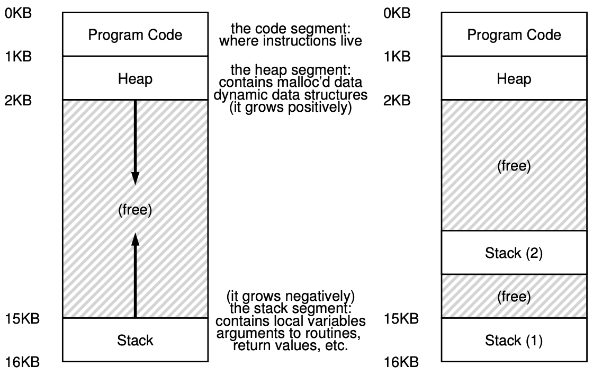

스택에 할당된 변수, 매개변수, 리턴 값, 그 외 스택에 넣은 기타 항목들은 `thread-local` storage라고 불리는 관련 스레드의 stack에 위치하게 된다.

### 26.1 Why Use Threads?

#### `parallelism`

> **각각 작업의 일부를 수행하는 여러 프로세서**를 이용하여 프로세스의 속도 향상

if you are executing the program on a system with multiple processors, you have the potential of speeding up this process considerably by **using the processors to each perform a portion of the work**

단일 스레드 프로그램을 **여러 CPU에서 작업을 수행**하는 프로그램으로 변환시키는 작업을 `parallelization`이라고 한다.

단일 CPU에서 작업이 이뤄지던 것을 여러 CPU에서 작업이 이뤄지도록 여러 스레드로 쪼개는 것을 병렬화라고 할 수 있다

#### 느린 I/O로 인한 프로그램 blokcing 회피

> 쓰레드는 단일 프로그램 내에서 **다른 활동과 I/O를 겹쳐서(overlap) 사용**할 수 있게 한다.

- different types of I/O
    - 다른 프로세스 또는 외부 시스템과의 메시지 송수신 대기
    - 읽기/쓰기 같은 명시적인 디스크 I/O 완료 대기
    - *page fault* 완료 암묵적으로(implicitly) 대기
  
> *`page fault`*?  
> fetch the required page from the secondary storage like a hard disk, and load it into the physical memory

while one thread in your program waits(i.e., is blocked waiting for I/O), the CPU scheduler can switch to other threads, which are ready to run and do something useful.

### 26.2 An Example: Thread Creation

[thread.rs::test_threads()](../src/chapters/concurrency/threads.rs) 참고

If there are multiple threads created and ready to be run, what runs next is determined by the OS **scheduler**, and although the scheduler likely implements some sensible algorithm, it is hard to know what will run at any given moment in time.

### 26.3 Why It Gets Worse: Shared Data

[test_invalid_access_shared_data](../src/chapters/concurrency/threads.rs) 참고.

예상은 각 스레드가 각각 `COUNTER`에 1씩 더해서, 총 20,000,000이 되는 것이 목표인 프로그램.

```shell
❯ cargo run
[Main] begin, COUNTER is 0
T1 Begin
T2 Begin
T2 Done
T1 Done
[Main] Done, COUNTER is 10121001

❯ cargo run
[Main] begin, COUNTER is 0
T1 Begin
T2 Begin
T2 Done
T1 Done
[Main] Done, COUNTER is 10518147
```

하지만, 쓰레드간에 공유되는 데이터에 바로 접근해서 수정하면 위와 같이 예상치 않은 결과가 나올 수 있다. 이는 **단일 프로세서에서 실행해도 마찬가지**다.

### 26.4 The Heart Of The Problem: Uncontrolled Scheduling

```assembly
mov 0x8049a1c, %eax     // 메모리 위치 0x8049a1c에서 값을 가져와서 eax 레지스터에 넣는다
add $0x1, %eax          // eax의 컨텐츠에 1을 더한다
mov %eax, 0x8049a1c     // 증가된 값을 다시 원래의 메모리 위치에 저장
```

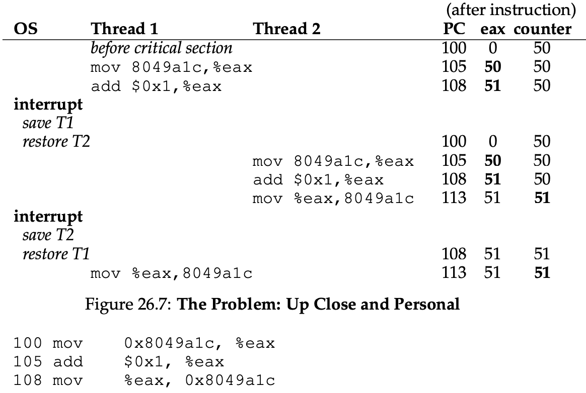

위 그림에서 `mov` 명령은 5 byte, `add` 명령어는 3 byte 메모리 차지

- `race condition`(`data race`): 거의 동시에 여러 실행 스레드가 `critical section`에 진입할 때 발생.
    1. counter의 값을 50이라고 가정
    2. Thread1:
        1. 값을 가져와서 1을 더하여 레지스터의 값이 51이 됨
        2. 하지만 timer interrupt 발생해서 OS는 쓰레드의 `TCB`에 현재 실행중인 쓰레드의 상태를 저장
    3. Thread2:
        1. Thread1의 결과가 반영이 안 되었으므로, 값을 가져와서 1을 더하여 레지스터의 값이 51이 됨
        2. 증가된 값을 다시 원래의 메모리 위치에 저장
        3. timer interrupt
    4. Thread1:
        1. 마지막 `mov` 실행하여 앞서 더했던 51을 원래 메모리 위치에 저장
    5. 1을 더하는 작업이 두 번 있었지만, 결과는 1을 한번만 더한 것과 같에 됨
- `indeterminate`
    - 실행 시마다 프로그램의 결과가 상이한 경우
    - 결과가 어떤 스레드가 실행되는지 타이밍에 의존
- `critical section`
    - 여러 thread가 실행하여 경쟁 상태가 되는 곳
    - 즉, **공유**(shared) 변수(공유 자원)에 접근하는 코드
- `mutual exclusion`
    - 한 스레드가 `critical section`을 실행하면, 다른 스레드는 차단
- `atomic`
    - 일련의 행동을 원자적으로 만드는 아이디어의 배경은 **all or nothing**
    - 하나로 묶길 원하는 액션들이 함께 발생하거나, 모두 발생하지 않거나 둘중 하나
- `transaction`
    - 여러 행동을 하나의 원자적 행위로 묶는 것

### 26.5 The Wish For Atomicity

- 하드웨어가 하나의 명령어로 원자적으로 실행하는 걸 지원해줄 수 있을까?
    - 그렇지는 않다. 가령 concurrent B-Tree 빌드하고 업데이트할 때 "B-Tree를 원자적으로 업데이트"하는 명령어 지원을 원하진 않는다.
    - 만약 "B-Tree를 원자적으로 업데이트"하는 명령어를 지원하려면, 하드웨어가 B-Tree 구조를 이해해야 하고, 그만큼 유연하지 않고 복잡해지며 효율도 떨어지게 된다
- `synchronization primitives`

### 26.6 One More Problem: Waiting For Another

> one thread must wait for another to complete some action before it continues
>
> I/O -> sleep -> I/O complete -> wake up

- synchronization primitives for atomicity
- mechanisms for sleeping/waking interaction

### 26.7 Summary: Why in OS Class?

- the OS was the first concurrent program
- For example, there are two processes running, both call `write()`. To do so, both
    1. must allocate a new block
    2. record in the inode of the file where this block lives
    3. change the size of the file to reflect the new size
- Because an interrupt may occur at any time, the code that updates these shared structures are `critical sections`;
- `shared structures`(`critical sections` of OS)?
    - bitmap for allocation
        - 메모리 블록, 디스크 공간, 프로세스 ID 등등 다양한 종류의 자원들의 할당을 추적하고 관리하는 데 사용되는 데이터 구조
        - 각 비트는 특정 자원의 상태를 나타낸다
    - the file’s inode
        - 유닉스 파일 시스템에서 사용되는 파일의 메타데이터를 저장하는 데이터 구조
        - 파일의 소유자, 접근 권한, 파일 크기, 파일 데이터 블록의 위치 등과 같은 정보를 포함
        - 각 파일은 고유한 inode를 가지며, 이는 파일의 식별자 역할
        - 디렉토리는 파일 이름과 해당 파일의 inode 번호를 매핑한 테이블을 가진다
    - page tables
    - process lists
    - file system structures
    - and virtually every kernel data structure
