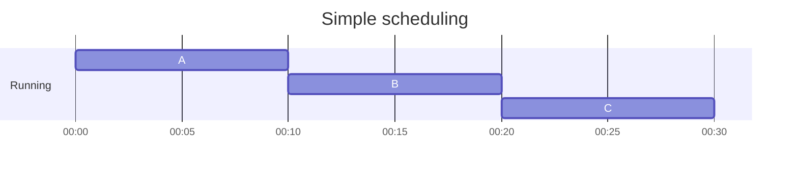
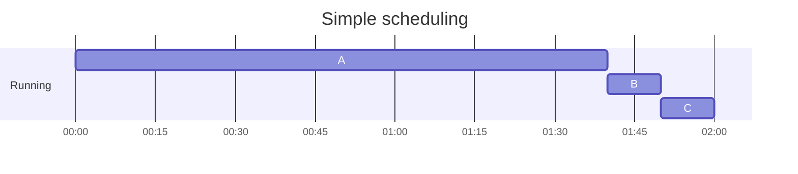
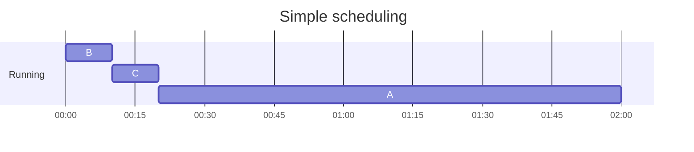
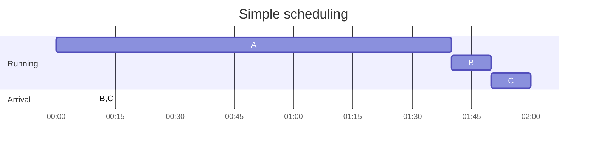
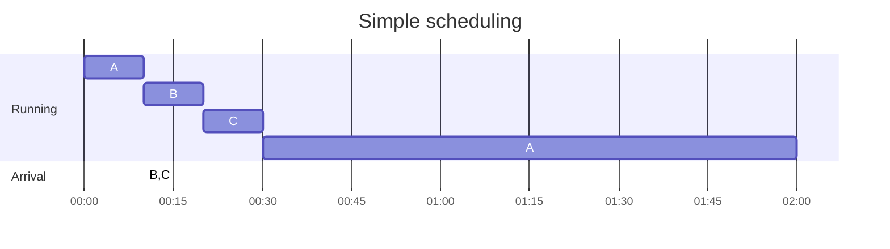
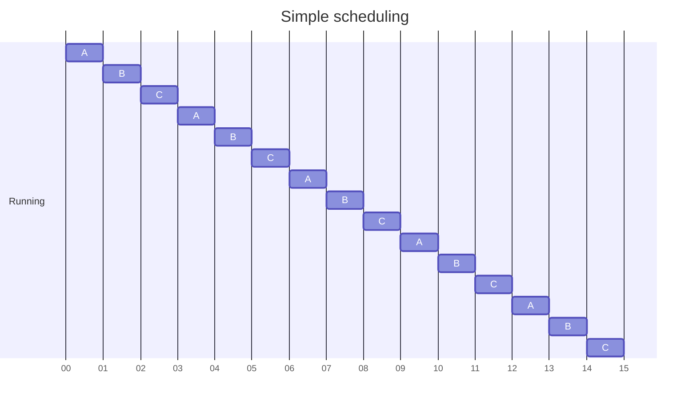

<!-- @format -->

# Summary

- [Summary](#summary)
    - [introduction](#introduction)
        - [가상화(virtualization)](#가상화virtualization)
            - [virtualizing the CPU](#virtualizing-the-cpu)
            - [virtualizing the Memory](#virtualizing-the-memory)
        - [동시성(concurrency)](#동시성concurrency)
        - [저장(persistence)](#저장persistence)
        - [Desgin Goal](#desgin-goal)
    - [The Abstraction: The Process](#the-abstraction-the-process)
        - [Process API](#process-api)
        - [Process Creation: A Littel More Detail](#process-creation-a-littel-more-detail)
        - [Process States](#process-states)
        - [Data Structures](#data-structures)
    - [Interlude: Process API](#interlude-process-api)
        - [`fork()`](#fork)
        - [`wait()`](#wait)
        - [`exec()`](#exec)
        - [API 동기부여](#api-동기부여)
        - [프로세스 제어와 유저](#프로세스-제어와-유저)
        - [기타 유용한 툴들](#기타-유용한-툴들)
    - [Direct Execution](#direct-execution)
        - [Basic Technique: **Limited** Direct Execution](#basic-technique-limited-direct-execution)
        - [Problem #1: Restricted Operations](#problem-1-restricted-operations)
        - [Problem #2: Switching Between Processes](#problem-2-switching-between-processes)
    - [Scheduling](#scheduling)
        - [Workload Assumptions](#workload-assumptions)
        - [Scheduling Metrics](#scheduling-metrics)
        - [First In, First Out (FIFO)](#first-in-first-out-fifo)
        - [Shortest Job First (SJF)](#shortest-job-first-sjf)
        - [Shortest Time-to-Completion First (STCF)](#shortest-time-to-completion-first-stcf)
        - [A New Metric: Response Time](#a-new-metric-response-time)
        - [Round Robin](#round-robin)
        - [Incorporating I/O](#incorporating-io)
        - [No More Oracle](#no-more-oracle)

[OSTEP book chapters](https://pages.cs.wisc.edu/~remzi/OSTEP/#book-chapters)

## introduction

### 가상화(virtualization)

OS transform physical into virtual, how does the operating system virtualize resources?

OS를 아래와 같이 부르기도 한다.
1. as virtual machine
2. as resource(CPU, memory, disk) manager

OS API for system calls -> standard library for applications

due to virtualization:
1. run many programs => sharing CPU
2. the programs can **concurrently** access their own instructions and data => sharing memory
3. the progrmas cna access devices => sharing disks and so forth

#### virtualizing the CPU

a single CPU as the seemingly infinite number of CPU.

#### virtualizing the Memory

물리적인 Memory는 bytes 배열.
1. read: 데이터가 저장된 `address`를 명시
2. write(update): 해당 주소에 쓰일 데이터를 명시

프로그램은 데이터를 메모리에 저장하고, load, stores 등의 명령어 통해 메모리에 접근하며, 각 프로그램의 명령(instruction)로 메모리에 있다. 따라서 메모리는 각 명령(instruction)을 가져올 때도 접근하게 된다

여러 프로그램이 각자 메모리 공간을 할당받는다. 해당 공간에 데이터 쓰기를 해도, 이는 각자의 가상 메모리 공간 내에서 이뤄지며, 다른 프로그램의 메모리를 업데이트하지는 않는다. 이는 물리적인 메모리를 다른 프로그램과 공유하기보다는, 각 프로그램이 각자의 private memory(**virtual address space**)를 갖기 때문이다.

### 동시성(concurrency)

> *Concurrent programming*, where different parts of a program execute independently, and *parallel programming*, where different parts of a program execute at the same time.
>
> 출처: [Fearless Concurrency](https://doc.rust-lang.org/book/ch16-00-concurrency.html)

OS는 여러 프로세스를 저글링 하듯 실행시키며, 각 프로세스는 또 여러 쓰레드를 가질 수 있다.

`thread`는,
1. 다른 함수와 같은 메모리 공간에서 실행되는 함수로 생각할 수 있으며,
2. 여러 개의 스레드가 동시에 활성화될 수 있다.

같은 메모리 공간에서 여러 함수가 같이 실행되므로, 만약 공유되는 메모리가 있고 이를 동시에 접근하게 된다면, 의도하지 않은 결과가 나올 수 있다.

```rs
fn worker() {
    for _i in 1..=WORKER_LOOPS {
        // 1. load the value of the counter(shared) from memory into a register
        COUNTER += 1; // 2.one to increment it and, 3. store it back into memory
    }
}
```

위 함수에서 `COUNTER`를 증가시키는 것은 세 가지 명령어(instruction)으로 구성된다
1. 공유되고 있는 `COUNTER`를 메모리에서 레지스터로 불러온다
2. 1을 증가시킨다
3. 증가된 `COUNTER`를 메모리에 저장한다

그런데 이 함수를 여러 쓰레드에서 동시에 실행시킬 떄, 저 세 명령어는 한번에 원자적(**atomically**)으로 실행되지 않는다. 따라서:
1. A 쓰레드에서 1을 증가시킬 때 B 쓰레드에서는 1을 증가시킨 값을 저장하고
2. 그 다음에 A 쓰레드가 증가시킨 값을 저장하면,
3. B가 증가시킨 값은 사라지게 된다

### 저장(persistence)

CPU나 메모리처럼 애플리케이션마다 가상화된 디스크를 만들지 않는다.
그보다는 오히려 파일의 정보를 **공유**하길 원한다고 가정한다

1. 새로운 파일이 어디에 위치할 것인지 파악하고, 이를 파일 시스템이 유지하는 다양한 구조 속에서 계속 트래킹해야 하며, 이는 더 로우 레벨에 있는 저장 장치에 I/O 요청하는 것이 필요하다
    1. 기존의 구조 읽기
    2. 수정하기
2. device driver를 작성해본 사람이라면 장치로 하여금 뭔가 하게 하는 것은 복잡한 일이며, low level에서의 장치 인터페이스와 정확한 의미에 대한 깊은 지식이 필요하다.
3. OS는 system call을 통해 장치에 접근할 수 있는 표준적이고 간단한 방법을 `standar library`로 제공한다

성능상의 이유로 대부분의 파일시스템은 먼저 이러한 쓰기를 더 큰 그룹으로 일괄 처리하기 위해 잠시 동안 시연시킨다

쓰기 동안의 시스템 충돌을 핸들링하기 위해, 대부분의 파일 시스템은 일종의 복잡한 쓰기 프로토콜인 `journaling` 또는 `copy-on-write`을 포함한다.
만약 쓰기 sequence 동안 실패한다면 나중에 시스템이 합리적인 상태로 복구될 수 있도록 디스크에 대한 쓰기 순서를 신중하게 지정한다.

서로 다른 공통 작업을 효율적으로 만들기 위해, file system은 간단한 목록에서부터 복잡한 b-tree까지 많은 다양한 자료 구조, 액세스 방법을 사용한다.

### Desgin Goal

- `virtualization` of resources
    - cpu
    - memory
    - disk
- treat `concurrency`
- `persistent` data
- `abstractions`
    - 큰 프로그램을 작성할 수 있도록 이를 이해할 수 있는 작은 조각들로 분할하는 것
    - `C > assembly > logic gate > processor > transistors`에서 C 언어로 개발할 때, 그 아래에 있는 것들을 신경쓰지 않도록 하는 것
- `protection` & `isolation`
    - 동시에 실행되는 애플리케이션이 서로 잘못된 영향을 주지 않도록 해야 한다
    - 그리고 OS 자체를 오염시키지 않아야 한다
- `reliability`
- `energy-efficiency`
- `security`
- `mobility`

OS가 개발되면서 축적된 아이디어들에 대해 알아보는 것도 설계에서 무엇이 중요한지 아는 데 도움이 된다.
- [BRINCH-HANSEN ON THE HISTORY OF OPERATING SYSTEMS](http://tristram.squarespace.com/home/2007/2/20/brinch-hansen-on-the-history-of-operating-systems.html)
- `procedure call`과 `system call`
    - `system call`은 하드웨어 권한 수준(hardware privilge level)을 높인다
    - [Difference Between System Call, Procedure Call, and Function Call](https://www.8bitavenue.com/difference-between-system-call-procedure-call-and-function-call/)
    - [Remote Procedure Calss vs Local Procedure Calls](https://www.baeldung.com/cs/remote-vs-local-procedure-calls)
    - [What is the difference between system calls and procedure calls?](https://qr.ae/pGdCgo)
    - [What Is the Difference Between Trap and Interrupt?](https://www.baeldung.com/cs/os-trap-vs-interrupt)
- `multiprogramming`
    - CPU 활용도 향상 목적
    - 여러 job들을 메모리에 로드하고 빠르게 switch
    - 느린 I/O 장치가 서비스 되는 동안 프로그램이 CPU에서 대기하면 CPU 시간 낭비

## The Abstraction: The Process

`process` == `running program`
- 프로그램 그자체는 실행되길 기다리는 명령어 뭉치일 뿐이다
- OS가 이 byte를 실행
- `process`는 프로그램을 실행하는 OS가 제공하는 추상화

CPU의 `time sharing`이라는 기본적인 테크닉 통해서 여러 프로그램을 동시에 실행할 수 있도록 한다.
- 낮은 수준의 기계(`machinery`)를 `mechanisms`(작동 방식)이라 부른다
    - 저수준의 메서드 또는 프로토콜
    - `time sharing` & `context switch`
- 높은 수준의 지능이 `policies`라는 형태로 OS에 존재
    - 정책은 OS에서 어떤 결정을 내리기 위한 알고리즘
    - `scheduling policy`

`machine state`: 프로그램 실행 중 읽거나 업데이트할 수 있는 것
- `memory`
    - `address space`
- `registers`
    - `program counter`(PC) == `instruction pointer`(IP)
        - 어떤 프로그램 명령어가 다음에 실행될지 말해준다
    - `stack pointer` & `frame pointer`
        - 함수 파라미터, 로컬 변수, 반환 주소(return addresses)을 관리

### Process API

프로세스와 관련하여 프로그램이 할 수 있는 요청들
- `Create`
- `Destroy`
- `Wait`
- `Miscellaneous Control`
- `Status`

### Process Creation: A Littel More Detail

> `load` code and static data from `disk` into `memory`
- load 방식
    - `eagerly`: 프로그램 실행 전에 한번에 로드
    - `lazily`: 프로그램 실쟁 동안 필요할 때 코드 조각과 데이터 로드
        - by `paging` & `swapping` of memory
- memory for `run-time stack`(a.k.a `stack`)
    - 인자(arguments)와 함께 스택을 초기화
    - 인자는 `argc`, `argv` 같은 배열로 `main()` 함수의 파라미터로 전달된다
- memory for `heap`
    - 명시적으로 요청되는, 동적으로 할당되는 데이터 위해 사용
    - 프로그램은 `malloc()` 같은 함수 호출해서 공간 요청
- default three `file descriptors`
    - STDIN
    - STDOUT
    - STRERR

### Process States

- `Running`: 프로세서에서 프로세스 실행중. 즉, 명령어 실행중
- `Ready`: 실행 준비 단계지만, 어떤 이유로 OS가 선택하지 않음
- `Blocked`: 다른 이벤트가 발생할 때까지 `Ready` 되지 않도록 만드는 작업을 프로세스가 수행한 경우. 가령 디스크에 I/O 요청을 발생시켰을 때, 블락되고 다른 프로세스가 processor를 사용

상태의 변화는 OS의 재량에 따르며, 이런 결정은 OS `scheduler`가 결정한다
- `Ready` to `Running`: scheduled
- `Running` to `Ready`: unscheduled
- `Running` -> initiate I/O request -> `Blocked` -> I/O completion -> `Ready`

### Data Structures

```c
// the registers xv6 will save and restore 
// to stop and subsequently restart a process
struct context {
  int eip;
  int esp;
  int ebx;
  int ecx;
  int edx;
  int esi;
  int edi;
  int ebp;
};

// the different states a process can be in
enum proc_state { 
  UNUSED, 
  EMBRYO, 
  SLEEPING,
  RUNNABLE, 
  RUNNING, 
  ZOMBIE // 종료됐지만 아직 정리되지 않은 프로세스 
};

// the information xv6 tracks about each process
// including its register context and state
struct proc {
  char *mem; // Start of process memory
  uint sz; // Size of process memory
  char *kstack; // Bottom of kernel stack
  // for this process
  enum proc_state state; // Process state
  int pid; // Process ID
  struct proc *parent; // Parent process
  void *chan; // If !zero, sleeping on chan
  int killed; // If !zero, has been killed
  struct file *ofile[NOFILE]; // Open files
  struct inode *cwd; // Current directory
  struct context context; // Switch here to run process
  struct trapframe *tf; // Trap frame for the
  // current interrupt
};
```

## Interlude: Process API

Unix 시스템은 프로세스 생성 위해 `fork()`와 `exec()`이라는 시스템 콜 한 쌍을 제공
`wait()`는 자신이 생성한 프로세스가 완료되기를 기다리려는 프로세스에서 사용할 수 있다

### `fork()`

### `wait()`

부모 프로세스와 자식 프로세스 중 무엇이 먼저 실행될지는 모르지만, `wait()` 시스템 콜을 사용해서
부모 프로세스가 먼저 실행될 경우 자식 프로세스를 기다리게 한다

```rs
// 부모 프로세스인 경우
Ok(NixParent { child, .. }) => {
    let result = waitpid(child, None);
    ... 생략 ...
}
```

### `exec()`

프로그램에서 다른 프로그램을 실행할 때 사용
`execvp()`은 코드(그리고 정적 데이터)를 그 실행할 수 프로그램에서 **로드**(load)해서 현재 코드 segment(와 현재 정적 데이터)를 덮어쓴다. 프로그램의 heap과 stack, 그리고 다른 메모리 공간들은 다시 초기화 된다. 그리고 OS는 그 프로그램을 실행시키고, 그 프로세스의 `argv`로 인자들을 넘긴다.

```rs
let words = execvp(
    &str_to_c_string("wc"),
    &[
        str_to_c_string("-cl"), // 안 먹히는듯?
        str_to_c_string(
            (env::current_dir().unwrap().as_path().display().to_string()
                + "/Cargo.toml")
                .as_str(),
        ),
    ],
);
```

따라서 새로운 프로세스를 생성하는 것이 아니라, 그보다는 현재 실행중인 프로그램을 다른 실행중인 프로그램(`wc`)로 변환한다.
자식 프로세스에서 `exec()`이 실행된 후에는 마치 부모 프로세스가 실행되지 않은 것과 같다. `exec()` 함수 호출이 성공하면 리턴하지 않기 때문이다.

### API 동기부여

이런 `fork()`와 `exec()`의 분리는 Unix shell을 빌드하는 데 필수적이다. 이런 `fork()`와 `exec()`의 분리는 shell이 **`fork()` 호출 다음**, **`exec()` 호출 전**에 코드를 실행하도록 하기 때문에, 이 코드는 실행 예정인(about-to-be-run) 프로그램의 환경을 바꿀 수 있고, 따라서 다양한 흥미로운 기능들을 쉽게 구현할 수 있다.

shell은 유저 프로그램이다. prompt가 나타나고, 뭔가 타이핑하길 기다린다.
커맨드를 타이핑하면, 대부분의 경우, 쉘은 다음과 같이 작동한다
1. 실행할 수 있는 프로그램이 파일 시스템 어디에 위치하는지 파악하고
2. 커맨드를 실행하기 위해 `fork()`를 호출하여 새로운 자식 프로세스를 만들고
3. 커맨드를 실행하기 위해 여러 `exec()` 변형 중 하나를 호출
4. `wait()` 호출하여 커맨드가 완료될 때까지 대기
5. 자식 프로세스가 끝나면 쉘은 `wait()`에서 돌아오며, prompt를 다시 출력하고 다음 커맨드를 기다린다

```shell
wc /Users/rody/VscodeProjects/ostep/Cargo.toml > /Users/rody/VscodeProjects/ostep/tmp/wc_output.txt
```

`>` 통해서 `wc`의 출력은 `wc_output.txt` 파일로 리다이렉트 된다.
1. `wc` 프로그램이 파일 시스템 어디에 위치하는지 파악
2. 커맨드를 실행하기 위해 `fork()`를 호출하여 새로운 자식 프로세스를 만들고
3. standard output을 닫고 `wc_output.txt`을 연다(이로 인해 곧 실행될(soon-to-be-running) 프로그램 `wc`의 출력은 스크린 대신 파일로 보내진다)
4. 커맨드를 실행하기 위해 여러 `exec()` 변형 중 하나를 호출
5. `wait()` 호출하여 커맨드가 완료될 때까지 대기
6. 자식 프로세스가 끝나면 쉘은 `wait()`에서 돌아오며, prompt를 다시 출력하고 다음 커맨드를 기다린다

유닉스 파이프는 같은 방식으로 구현되지만, `pipe()` 시스템 콜을 호출한다.
1. 한 프로세스의 출력이 커널 내부(in-kernal)의 파이프(즉, 큐)로 연결되고,
2. 다른 프로세스의 입력 부분이 같은 파이프로 연결된다.
3. 따라서 한 프로세스의 출력이 매끄럽게 다음 프로그램의 입력으로 사용된다.

### 프로세스 제어와 유저

- `kill()`: 프로세스에 signal 보낼 때 사용
    - pause, die 등의 명령어
    - 편의를 위해 유닉스 쉘에는 특정 키 스트로크 조합이 특정 신호를 보내도록 설정되어 있음
        - control + c: *SIGINT*(interrupt) 보통 프로세스 종료
        - control + z: *SIGTSTP*(stop) 실행중 일시 정지. `fg` 같은 내장 명령어로 다시 실행 가능
    - 외부의 이벤트를 프로세스로 전달하는 신호(signal)들 제공하며, 개별 프로세스와 전체 프로세스 그룹에 신호를 보낼 수 있다
- `signal()`: 프로세스가 시스템 콜을 캐치하기 위해 사용

그렇다면 누가 시그널을 보낼 수 있고 누구는 보낼 수 없는가? 보통 여러 사용자가 시스템을 사용하며, 누군가 임으로 신호를 보낼 수 있다면 시스템의 사용성과 보안성이 저하된다. 따라서 요즘 시스템은  `user`라는 강력한 개념을 포함한다.

### 기타 유용한 툴들

- `man`
- `ps`
- `top`
- `spawn`
- `killall`
- CPU meters like [MenuMeters](http://www.ragingmenace.com/software/menumeters/)

## Direct Execution

CPU 가상화는 각 프로세스를 잠깐씩 실행하는 `time sharing`을 통해서 이뤄진다. 그런데 이런 가상화 작동 방식을 구현하는 데는 몇 가지 문제가 있다.
1. *performance*: 추가적인 부하 없이 가능한가?
2. *control*: CPU에 대한 제어를 유지하면서 어떦게 프로세스를 효율적으로 실행?

### Basic Technique: **Limited** Direct Execution

`direct execution`? just run the program directly on the CPU
1. 프로세스 리스트에 프로세스 entry 생성
2. 프로그램 위한 메모리 할당
3. 디스크에서 프로그램 코드를 메모리로 로드
4. `argc`, `argv`로 스택 셋업
5. registers 비우기
6. `main()` 같은 루틴의 진입점(entry point)을 찾아서 해당 지점으로 이동
7. 유저의 코드를 실행시키기 시작
8. 프로세스의 메모리 해제(free)
9. 프로세스 리스트에서 삭제

이런 접근 방식은 CPU 가상화에 몇 가지 문제점 야기
1. 어떻게 OS로 하여금 프로그램이 우리가 원하지 않는 것을 안하게 하도록 보장?
    - `user mode`, `kernal mode`로 권한 분리
2. 어떻게 OS가 실행중인 프로그램을 멈추고 다른 프로세스로 전환?

### Problem #1: Restricted Operations

- `user mode`: 프로세스가 원하는대로 모든 자원을 사용하지 못하도록 제한하는 processor mode
- `kernal mode`: OS가 실행되는 모드로, 모든 제한된 명령을 실행할 수 있다

만약 유저 모드의 프로그램이 권한이 필요한 작업을 수행하길 원한다면? 요즘의 모든 하드웨어는 가상적으로(virtually) system call을 요청할 수 있도록 하고 있다

user mode process
-> `trap` instruction
-> jump into kernal
-> kernal mode
-> `return-from-trap` call by OS

On x86
1. The processor will push the program counter, flags, and a few other registers onto a per-process `kernel stack`
2. the `return-from-trap` will pop these values off the stack
3. and resume execution of the user-mode program

How does the `trap` know which code to run inside the OS?
- 호출하는 프로세스는 어떤 주소로 이동해야 하는지 지정할 수 없다. 만약 호출하는 프로세스에서 주소를 지정할 수 있다면 커널 어디로든 이동할 수 있게 된다
- 따라서 반드시 커널이 `trap`에서 어떤 코드가 실행되는지 신중하게 제어해야 한다
- 이를 부트 타임에 `trap table`를 설정하여 이를 달성한다

1. At boot
    1. [OS] initialize `trap table`
    2. [H/W] CPU remembers *address* of syscall handler(`trap table`). 다음 재부팅 시까지 기억.
2. At run
    1. [OS]
        1. [OS] 프로세스 리스트에 entry 생성
        2. [OS] 프로그램 메모리 할당
        3. [OS] 디스크에서 프로그램 코드를 메모리로 로드
        4. [OS] `argc`, `argv`로 유저 스택 셋업
        5. [OS] 각 프로세스가 갖는 커널 스택을 reg/PC로 채우기(Clear registers?)
        6. [OS] `return-from-trap`
    2. [H/W]
        1. [H/W] 커널 스택에서 regs 복구
        2. [H/W] *유저 모드*로 이동
        3. [H/W] `main()`으로 이동
    3. [Program]
        1. [Program] `main()` 실행
        2. [Program] system call 요청
        3. [Program] OS로 `trap`
    4. [H/W]
        1. [H/W] regs를 커널 스택에 저장
        2. [H/W] *커널 모드*로 이동
        3. [H/W] `trap handler`로 이동
    5. [OS]
        1. [OS] `trap` 핸들링
        2. [OS] syscall에 대한 작업 수행
        3. [OS] `return-from-trap` to return control
    6. [H/W]
        1. [H/W] 커널 스택에서 regs 복구
        2. [H/W] *유저 모드*로 이동
        3. [H/W] `trap` 이후 PC로 이동
    7. [Program]
        1. [Program] return from main
        2. [Program] `trap`(via `exit()`)
    8. [OS]
        1. [OS] 프로세스의 메모리 해제(free)
        2. [OS] 프로세스 리스트에서 삭제

### Problem #2: Switching Between Processes

만약 프로세스가 CPU에서 실행중이라면, 이는 정의상 OS가 실행되고 있지 않음을 의미. 그렇다면 OS는 어떻게 CPU에 대한 제어를 다시 얻을 수 있을까?

- `cooperative` 접근법: 시스템 콜을 기다린다
    - 프로세스가 정상적으로 행동할 것으로 신뢰
    - 대부분의 프로세스가 상당히 자주 system call 요청
    - 이런 시스템은 주로 명시적인 `yield` 시스템 콜을 포함하며, 이 시스템 콜은 제어를 OS로 넘긴다
    - 0으로 나누기 한다거나, 접근하면 안 되는 메모리에 접근하려고 할 때, OS에 `trap`을 생성하고, OS는 CPU에 대한 제어를 다시 얻게 된다
- `Non-cooperative` 접근법: OS가 제어를 가져온다
    - `timer interrupt`: 수 밀리초마다 interrupt 발생시키고, 미리 구성된 `interrupt handler` 실행
    - 이 타이머 또한 꺼질 수 있으며, 나중에 동시성(concurrency)를 더 깊게 이해할 때 논하기로 한다
    - 인터럽트 발생 시 나중에 `return-from-trap` 때 중지된 프로그램이 정상적으로 다시 시작될 수 있도록, 하드웨어는 실행중이던 프로그램의 충분한 상태를 저장할 책임이 있다

어떤 식으로든 OS가 프로세스 스위칭을 결정하면, OS는 `context switch`라는 저수준의 코드 조각을 실행

// TODO: 나중에 다시 보기
1. At boot
    1. [OS]
        1. [OS] initialize trap table
    2. [H/W]
        1. [H/W] remember addresses of syscall handler
        2. [H/W] remember addresses of timer handler
    3. [OS]
        1. [OS] start interrupt timer
    4. [H/W]
        1. [H/W] start timer
        2. [H/W] interrupt CPU in X ms
2. At run
    1. [A Process]...
    2. [H/W]
        1. [H/W] timer interrupt
        2. [H/W] save (A)regs → (A)kernal-stack
        3. [H/W] move to kernel mode
        4. [H/W] jump to trap handler
    3. [OS]
        1. [OS] Handle the trap
        2. [OS] timer interrupt handler decides to switch from A-process to B-process
        3. [OS] Call `switch()` routine
        4. [OS] save (A)regs → to (A)process-structure in memory
        5. [OS] restore (B)regs ← from (B)process-structure in memory
        6. [OS] switch to (B)kernal-stack by changing the stack pointer(`switch context`)
        7. [OS] `return-from-trap` (into B)
    4. [H/W]
        1. [H/W] restore (B)regs ← (B)kernal-stack
        2. [H/W] move to user mode
        3. [H/W] jump to B’s PC
    5. [B Process]...

```assembly
### context switch code for xv6
# void swtch(struct context **old, struct context *new);
#
# Save current register context in old
# and then load register context from new.
.globl swtch
swtch:
    # Save old registers
    movl 4(%esp), %eax      # put old ptr into eax
    popl 0(%eax)            # save the old IP
    movl %esp, 4(%eax)      # and stack
    movl %ebx, 8(%eax)      # and other registers
    movl %ecx, 12(%eax)
    movl %edx, 16(%eax)
    movl %esi, 20(%eax)
    movl %edi, 24(%eax)
    movl %ebp, 28(%eax)

    # Load new registers
    movl 4(%esp), %eax      # put new ptr into eax
    movl 28(%eax), %ebp     # restore other registers
    movl 24(%eax), %edi
    movl 20(%eax), %esi
    movl 16(%eax), %edx
    movl 12(%eax), %ecx
    movl 8(%eax), %ebx
    movl 4(%eax), %esp      # stack is switched here
    pushl 0(%eax)           # return addr put in place
    ret                     # finally return into new ctxt
```

동시에 interrupt가 발생하는 것을 방지하기 위해 인터럽트가 실행중인 경우에는 다른 인터럽트를 불가능하게 만들 수 있다. 또는 locking 통해서 내부 자료 구조에 동시에 접근하는 것을 방지한다.

`lmbench` 툴을 사용하면 컨텍스트 스위칭, 시스템 콜 등에lmbench 소요되는 시간 측정 가능.
타이머는 `gettimeofday()`, `rdtsc` of x86 등 참고
`sched_setaffinity()`로 프로세스를 특정 프로세서에 바인드 가능

## Scheduling

- for turnaround time
    - SJF
    - STCF
- for response time
    - Round Robin

### Workload Assumptions

process(또는 job)에 대한 가정
> 1. 각 job은 같은 시간 동안 실행  
> 2. 모든 job은 동시에 도착(arrive)
> 3. 한번 시작하면 모든 job은 완료될 때까지 실행
> 4. 모든 job은 CPU만 사용(I/O 없음)
> 5. 각 job의 run-time은 알고 있다

### Scheduling Metrics

> `metric`?
> something that we use to *measure* something

스케쥴링 시 여러 메트릭이 존재할 수 있지만, 여기서는 간단하게 처리 시간(`turnaround time`) 지표만 고려.

> `turnaround time`?
> the time at which the job completes minus the time at which the job arrived in the system
>
> $T_{turnaround} = T_{completion} - T_{arrival}$

앞서 모든 job이 동시에 arrive한다고 가정했으므로, $T_{arrival} = 0$으로 보고, 따라서 $T_{turnaround} = T_{completion}$이 된다.

### First In, First Out (FIFO)

First Come, First Served



평균 turnaround time은 ${{10+20+30 \over 3} = 20}$

> ~~1. 각 job은 같은 시간 동안 실행~~ 가정 제거  
> 2. 모든 job은 동시에 도착(arrive)  
> 3. 한번 시작하면 모든 job은 완료될 때까지 실행  
> 4. 모든 job은 CPU만 사용(I/O 없음)  
> 5. 각 job의 run-time은 알고 있다  



평균 turnaround time은 ${{100+110+120 \over 3} = 110}$

이렇게 상대적으로 짧은 시간 동안 자원을 소비하는 것이 자원을 크게 소모하는 것보다 나중에 대기열에 들어오는 것을 일반적으로 `convoy effect`라고 한다.

### Shortest Job First (SJF)



평균 turnaround time은 ${{10+20+120 \over 3} = 50}$

> ~~1. 각 job은 같은 시간 동안 실행~~ 가정 제거  
> ~~2. 모든 job은 동시에 도착(arrive)~~ 가정 제거  
> 3. 한번 시작하면 모든 job은 완료될 때까지 실행  
> 4. 모든 job은 CPU만 사용(I/O 없음)  
> 5. 각 job의 run-time은 알고 있다  



평균 turnaround time은 ${{100+(110-10)+(120-10) \over 3} = 103.33}$

### Shortest Time-to-Completion First (STCF)

> ~~1. 각 job은 같은 시간 동안 실행~~ 가정 제거  
> ~~2. 모든 job은 동시에 도착(arrive)~~ 가정 제거  
> ~~3. 한번 시작하면 모든 job은 완료될 때까지 실행~~ 가정 제거  
> 4. 모든 job은 CPU만 사용(I/O 없음)  
> 5. 각 job의 run-time은 알고 있다  

타이머 인터럽트와 컨텍스트 스위칭에 대해 논의했던 바와 같이, 스케쥴러는 B와 C가 도착하면 그와 비슷한 작업을 수행할 수 있다.

job A를 중단시킨(preempt) 후 다른 작업들을 실행시키고, 나중에 A를 다시 재개할 수 있다.



`SJF`에 선점(preemption)할 수 있도록 한 것을, `Shortest Time-to-Completion First (STCF)` 또는 `Preemptive Shortest Job First (PSJF)`라고 한다

평균 turnaround time은 ${{(120-0)+(20-10)+(30-10) \over 3} = 50}$

### A New Metric: Response Time

초기 배치 컴퓨터 시스템에서는 이 정도 알고리즘의 스케쥴링으로도 괜찮았다. 하지만, 시분할 머신(time-shared machine)의 등장으로 사용자들은 시스템과 상호작용할 수 있는 퍼포먼스를 기대하게 됐고, 그에 따라 새로운 지표인 `response time`이 등장하게 됨.

이를 job이 도작한 때부터 처음 스케쥴 되는 때까지의 시간으로 정의.

$T_{response} = T_{first\_run} - T_{arrival}$


- response time avg: 3.33
    - A: 0  (00:00 도착, 00:00 스케쥴)
    - B: 0  (00:10 도착, 00:10 스케쥴)
    - C: 10 (00:10 도착, 00:20 스케쥴)

### Round Robin

> what RR is doing is stretching out each job as long as it can, by only running each job for a short bit before moving to the next.

job을 완료할 때까지 실행시키는 대신, 시간 할당량(time slice, 또는 scheduling quantum 시간 양자) 동안 job을 실해이키고 실행 큐의 다른 job을 실행

시간 할당량의 길이는 timer-interrupt 기간의 곱이어야 한다. 따라서 timer-interrupt가 10ms라면, 시간 할당량은 10ms, 20ms...여야 한다.

시간 할당량이 1초인 경우 작업들을 빠르게 순환(cycle)



시간 할당량이 짧을수록 `response time` 지표상의 성능이 더 좋아지지만, context switching 비용이 전체 성능을 지배하게 된다

따라서 시간 할당량은
1. 컨텍스트 스위칭 비용을 분산(amortize) 시킬만큼 길되,
2. 너무 길어서 시스템이 응답하지 못할 정도

가령 시간 할당량 10ms에 context switching 비용이 1ms라면, 10%의 시간이 컨텍스트 스위칭에 사용되고 낭비된다. 이를 분산하기 위해 만약 시간 할당량을 100ms로 늘린다면, 1%의 시간이 컨텍스트 스위칭에 사용되고 시간 할당량의 비용이 분산된다.

시간 할당량이 1s이고, 실행 시간이 각 5초인 A, B, C 세 프로그램이 RR로 스케쥴링될 때,
A는 13초, B는 14초, C는 15초에 끝나고, 평균 14초가 소요되는데, 처리량 지표에서는 상당히 좋지 않다.

만약 FIFO라면, 각각 5초, 10초, 15초에 끝나고, ${5 + 10 + 15 \over 3} = 10$ 초가 된다.

불공정하게 시간 배분
-> 더 짧은 시간의 job을 먼저 실행하여 처리 시간 지표에서 성능 향상
-> 하지만 응답 시간 지표에서 성능 하락

공정하게 시간 배분
-> 응답 시간 지표에서 성능 향상
하지만 처리 시간 지표에서 성능 하락

### Incorporating I/O

> ~~1. 각 job은 같은 시간 동안 실행~~ 가정 제거  
> ~~2. 모든 job은 동시에 도착(arrive)~~ 가정 제거  
> ~~3. 한번 시작하면 모든 job은 완료될 때까지 실행~~ 가정 제거  
> ~~4. 모든 job은 CPU만 사용(I/O 없음)~~ 가정 제거  
> 5. 각 job의 run-time은 알고 있다  

A: 50ms of CPU, and I/O per 10ms
B: 50ms of CPU only
I/O: 10ms

1. STCF & I/O 고려하지 않는 경우
A와 B의 실행 실행 시간이 같으므로 다른 프로그램을 선점하지 않게 된다. 이때 A가 먼저 실행되면, 10ms마다 I/O가 실행되어 실제로는 A만 90ms의 시간이 소요된다

```text
CPU     A       A       A       A       A   B   B   B   B   B
DISK        A       A       A       A
            20      40      50      80      100     120     140
```

2. STCF & I/O 고려하는 경우
A의 I/O per 10ms를 하나의 서브 job으로 본다면, STCF 정책에 따라 더 짧은 A의 10ms sub job을 실행하고, 그 작업이 끝나면 남은 B를 실행하고, 다시 A의 sub job을 실행하게 된다. 이렇게 함으로써 겹침(`overlap`)이 가능하고, I/O가 끝나길 기다리는 동안 다른 프로세스를 위해 CPU를 사용할 수 있다

```text
CPU     A   B   A   B   A   B   A   B   A   B
DISK        A       A       A       A
            20      40      50      80      100     120     140
```

각 CPU burst를 하나의 작업(job)으로 처리함으로써, 스케쥴러는 interactive한 프로세스가 자주 실행되도록 보장

### No More Oracle

> ~~1. 각 job은 같은 시간 동안 실행~~ 가정 제거  
> ~~2. 모든 job은 동시에 도착(arrive)~~ 가정 제거  
> ~~3. 한번 시작하면 모든 job은 완료될 때까지 실행~~ 가정 제거  
> ~~4. 모든 job은 CPU만 사용(I/O 없음)~~ 가정 제거  
> ~~5. 각 job의 run-time은 알고 있다~~ 가정 제거  

실제로는 OS가 각 작업의 시간을 아는 경우는 드물다. OS가 미래를 볼 볼 수는 없기 때문이다.

이를 해결하기 위해 최근 과거를 사용하여 미래를 예측하는 스케쥴러를 알아보도록 할 것이다. 이는 multi-level feedback queue(MLFQ)로 알려져 있다.
